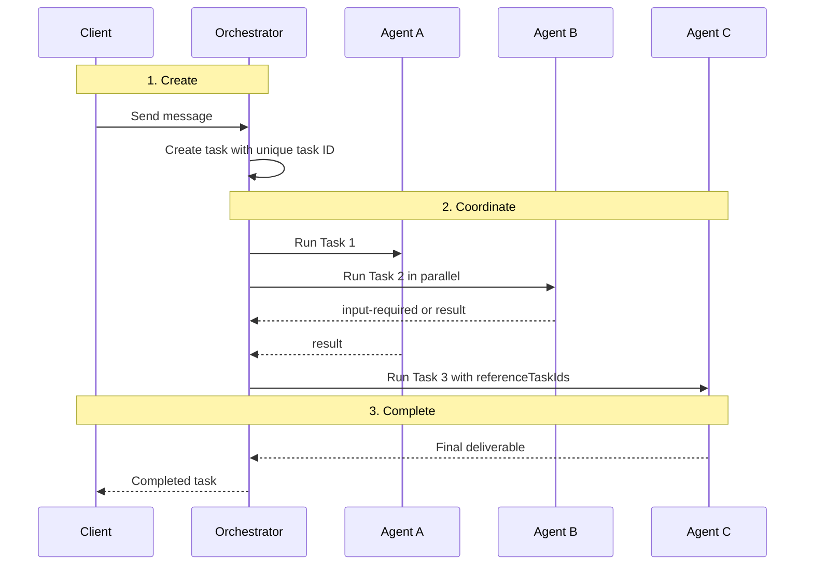

Messages alone are enough for a simple chat loop. They are not enough when several agents are working at once, some tasks depend on others, and parts of the workflow may pause for input before continuing.

## Why Task-First Matters

In [Key Concepts](/bindu/introduction/key-concepts#task-lifecycle--states), you saw how Bindu task states enable interactive conversations. The reason Bindu leans so hard on tasks is that tasks are what make orchestration possible in the first place.

| Message-first thinking | Task-first thinking |
| --- | --- |
| Communication is easy, but execution is hard to track | Every unit of work has a durable identifier and state |
| Parallel work becomes ambiguous | Multiple tasks can run at the same time with separate IDs |
| Dependencies live in application logic only | `referenceTaskIds` makes task relationships explicit |
| Paused work is hard to resume cleanly | State tells you whether work is `working`, `input-required`, or done |
| Multi-agent coordination gets messy quickly | Orchestrators can manage work by task instead of by guesswork |

That is the shift: in Bindu, a task is not just a log entry or status wrapper. It is the unit that makes parallel execution, dependency tracking, and interactive workflows manageable.

<Note>
Bindu follows the A2A "Task-only Agent" pattern where all responses are Task objects. That is what gives orchestrators a stable unit to coordinate at scale.
</Note>

## How The Task-First Pattern Works

Every message creates a task that moves through a lifecycle such as `submitted` -> `working` -> `input-required` -> `completed`. The message starts the work, but the task is what tracks it.

### The Core Model

A task gives the system a few things that a plain message cannot:

- a unique task ID
- clear task state
- explicit dependency links through `referenceTaskIds`
- safe parallel execution across agents

<CardGroup cols={3}>
  <Card title="Trackable" icon="list-tree">
    Every interaction becomes a unit of work with its own task ID.
  </Card>
  <Card title="Stateful" icon="clock">
    A task can be working, blocked on input, completed, or failed without losing the thread of execution.
  </Card>
  <Card title="Composable" icon="boxes-stacked">
    Tasks can depend on other tasks, which is what makes orchestration and parallelism practical.
  </Card>
</CardGroup>

### The Lifecycle: Create, Coordinate, Complete

Under the hood, every task-first workflow moves through three practical stages.



<Steps>
  <Step title="Creation">
    A message creates a task. That task gets a unique ID and starts its lifecycle in a known state.

    The quick recap is still the core of the model:

    ```text
    submitted -> working -> input-required -> completed
    ```

    The important part is not only the message itself. It is the fact that the work now has a durable identity the system can track.
  </Step>

  <Step title="Coordination">
    Once work has task IDs, orchestrators can coordinate several pieces of work at the same time.

    Real-world example: travel planning

    ```text
    Task1 -> WeatherAgent: "Check Helsinki weather next week"
      -> Returns: weather-data.json

    Task2 -> FlightAgent: "Book flight" (references Task1)
      -> Asks: "How many travelers?"
      -> State: input-required

    Task3 -> HotelAgent: "Find hotel" (runs in parallel with Task2)
      -> Returns: hotel-booking.pdf

    Task4 -> ItineraryAgent: "Create itinerary" (waits for Task2 & Task3)
      -> referenceTaskIds: [Task2, Task3]
      -> Returns: complete-itinerary.pdf
    ```

    Without task IDs, the orchestrator could not keep that workflow straight. With task IDs, dependencies and parallel work become explicit.
  </Step>

  <Step title="Completion">
    The task reaches a terminal state when the work is done, fails, is canceled, or is rejected.

    At that point, the task becomes immutable. If the user wants refinement later, the system creates a new task instead of reopening the old one.
  </Step>
</Steps>

---

## Messages Vs Artifacts

Tasks sit at the center, but messages and artifacts still play different roles around them.

| Aspect | Messages | Artifacts |
| --- | --- | --- |
| **Purpose** | Interaction, negotiation, status updates, explanations | Final deliverable, task output |
| **Task State** | `working`, `input-required`, `auth-required`, `completed`, `failed` | `completed` only |
| **When Used** | During task execution AND at completion | When task completes successfully |
| **Immutability** | Task still mutable (non-terminal) or immutable (terminal) | Task becomes immutable |
| **Content** | Agent's response text, explanations, error messages | Structured deliverable (files, data) |

The distinction is important:

- **Intermediate states** (`input-required`, `auth-required`) - message only, no artifacts
- **Completed state** - message (explanation) plus artifact (deliverable)
- **Failed state** - message (error explanation) only, no artifacts
- **Canceled state** - state change only, no new content

<Note>
Messages carry the conversation while work is happening. Artifacts carry the deliverable once the work is done.
</Note>

### Task State Rules

There are two broad categories of task state.

**Non-terminal (task open):**

- `submitted`
- `working`
- `input-required`
- `auth-required`

**Terminal (task immutable):**

- `completed`
- `failed`
- `canceled`
- `rejected`

## A2A Protocol Compliance

The task-first model lines up with the A2A protocol in a few concrete ways.

<CardGroup cols={3}>
  <Card title="Task Immutability" icon="shield-check">
    Terminal tasks cannot restart. Refinements create new tasks.
  </Card>
  <Card title="Context Continuity" icon="link">
    Multiple tasks can share `contextId` so conversation history stays coherent.
  </Card>
  <Card title="Dependency Management" icon="list-tree">
    `referenceTaskIds` gives the system a clean way to express chained work.
  </Card>
</CardGroup>

The practical consequences are:

- **Task Immutability** - terminal tasks cannot restart; refinements create new tasks
- **Context Continuity** - multiple tasks share `contextId` for conversation history
- **Parallel Execution** - tasks run independently, tracked by unique IDs
- **Dependency Management** - use `referenceTaskIds` to chain tasks

## The Value Of Task-First Execution

This model matters most when workflows stop being linear.

<AccordionGroup>
  <Accordion title="Parallel execution">
    Multiple tasks can run at the same time because each task has its own ID and state. The system does not need to overload one message thread with all active work.
  </Accordion>

  <Accordion title="Dependency tracking">
    When one task depends on another, `referenceTaskIds` makes that dependency explicit. This is what lets an orchestrator wait for Task2 and Task3 before starting Task4.
  </Accordion>

  <Accordion title="Interactive pauses">
    A task can move into `input-required` or `auth-required` and stay there until the missing piece arrives. That pause does not destroy the task or require the system to infer where to resume.
  </Accordion>

  <Accordion title="Multi-agent coordination">
    Orchestrators like Sapthami can coordinate several agents because the work is represented as tasks, not just as a pile of messages with implied state.
  </Accordion>
</AccordionGroup>

## Related

* /bindu/introduction/key-concepts
* /bindu/concepts/protocol

---

<span className="brand-quote">
  

  <span className="brand-quote-text">
    Bindu treats work as{" "}
    <span className="brand-quote-highlight">
      something to track, coordinate, and complete explicitly
    </span>
    , so multi-agent execution stays understandable as systems grow.
  </span>
</span>
