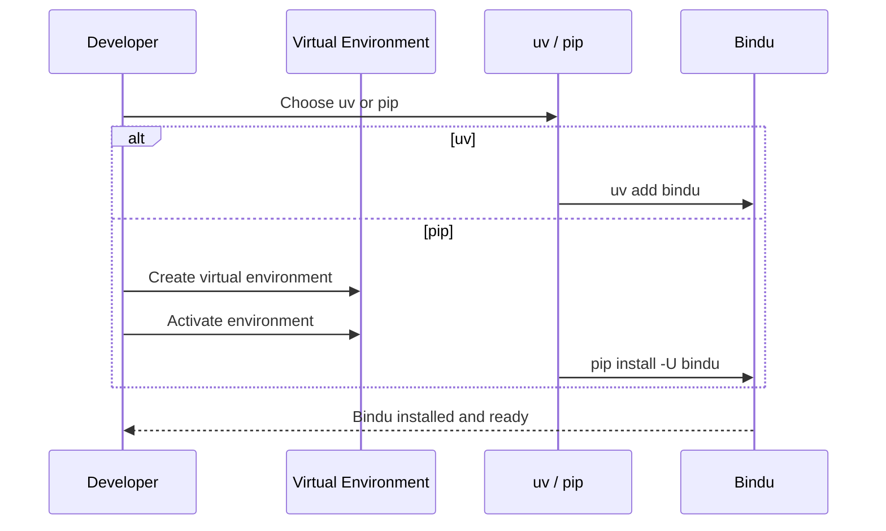

The install step should be boring. You should be able to get Bindu into your environment, verify that it works, and move on to building the agent.

## Why This Matters

The first setup step sets the tone for the rest of the experience. If installation is messy, everything after it gets harder. If it is clean, you get to the part that actually matters much faster.

<Note>
This page covers two install paths: `uv` if you want the shortest route, and `pip` if you prefer a standard virtual environment workflow.
</Note>

## How To Install Bindu

You can install Bindu with `uv` or `pip`. `uv` is the recommended path.

### Using `uv` (Recommended)

```bash
uv add bindu
```

<CardGroup cols={2}>
  <Card title="Recommended Path" icon="rocket">
    `uv` is the shortest way to add Bindu and keep dependency management simple.
  </Card>
  <Card title="Standard Path" icon="package">
    If your workflow already uses `pip` and virtual environments, that still works fine.
  </Card>
</CardGroup>

### The Setup Flow



<Steps>
  <Step title="Use uv">
    If you already use `uv`, install Bindu directly:

    ```bash
    uv add bindu
    ```
  </Step>

  <Step title="Use pip">
    If you want a traditional virtual environment setup, create one first and then install Bindu.

    <CodeGroup>
      ```bash Mac
      python3 -m venv ~/.venvs/bindu
      source ~/.venvs/bindu/bin/activate
      pip install -U bindu
      ```

      ```bash Windows
      python3 -m venv binduenv
      binduenv/scripts/activate
      pip install -U bindu
      ```
    </CodeGroup>
  </Step>

  <Step title="Fix Common Installer Issues">
    If installation fails, update `pip` and retry:

    ```bash
    python -m pip install --upgrade pip
    ```
  </Step>
</Steps>

---

## Contributing

If you want to work on Bindu itself, set up the development environment from the repository.

```bash
# Clone the repository
git clone https://github.com/getbindu/Bindu.git
cd Bindu

# Install development dependencies with uv
uv sync

# Install pre-commit hooks
pre-commit run --all-files
```

Each command has a specific job:

- `git clone` gets the source locally
- `cd Bindu` moves into the repository
- `uv sync` installs the development dependencies
- `pre-commit run --all-files` runs the configured code-quality checks

<Note>
See our [Contributing Guidelines](https://github.com/getbindu/Bindu/blob/main/.github/contributing.md) for more details.
</Note>

## Practical Notes

<AccordionGroup>
  <Accordion title="When should I use uv?">
    Use `uv` if you want the recommended path and a shorter setup flow:

    ```bash
    uv add bindu
    ```
  </Accordion>

  <Accordion title="When should I use pip?">
    Use `pip` if your local workflow already depends on a standard Python virtual environment.

    <CodeGroup>
      ```bash Mac
      python3 -m venv ~/.venvs/bindu
      source ~/.venvs/bindu/bin/activate
      pip install -U bindu
      ```

      ```bash Windows
      python3 -m venv binduenv
      binduenv/scripts/activate
      pip install -U bindu
      ```
    </CodeGroup>
  </Accordion>

  <Accordion title="What should I do if pip fails?">
    Update `pip` first and try again:

    ```bash
    python -m pip install --upgrade pip
    ```
  </Accordion>

  <Accordion title="How do I set up the repo for development?">
    Clone the repository, sync dependencies, and run the pre-commit checks:

    ```bash
    git clone https://github.com/getbindu/Bindu.git
    cd Bindu
    uv sync
    pre-commit run --all-files
    ```
  </Accordion>
</AccordionGroup>

## Related

- /bindu/introduction/what-is-bindu
- /bindu/introduction/join-the-internet-agents
- https://github.com/getbindu/Bindu/blob/main/.github/contributing.md

---

<span className="brand-quote">
  

  <span className="brand-quote-text">
    Bindu keeps the first step{" "}
    <span className="brand-quote-highlight">
      simple enough to start fast
    </span>
    , so you can spend your time building agents instead of babysitting setup.
  </span>
</span>
