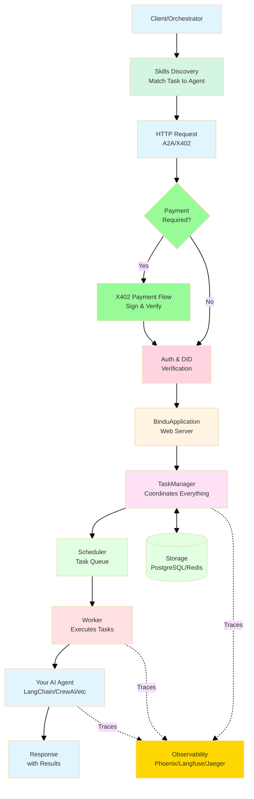
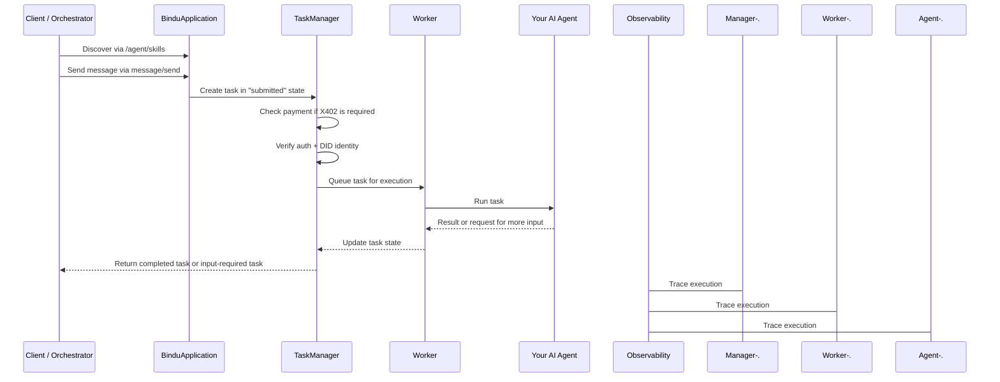
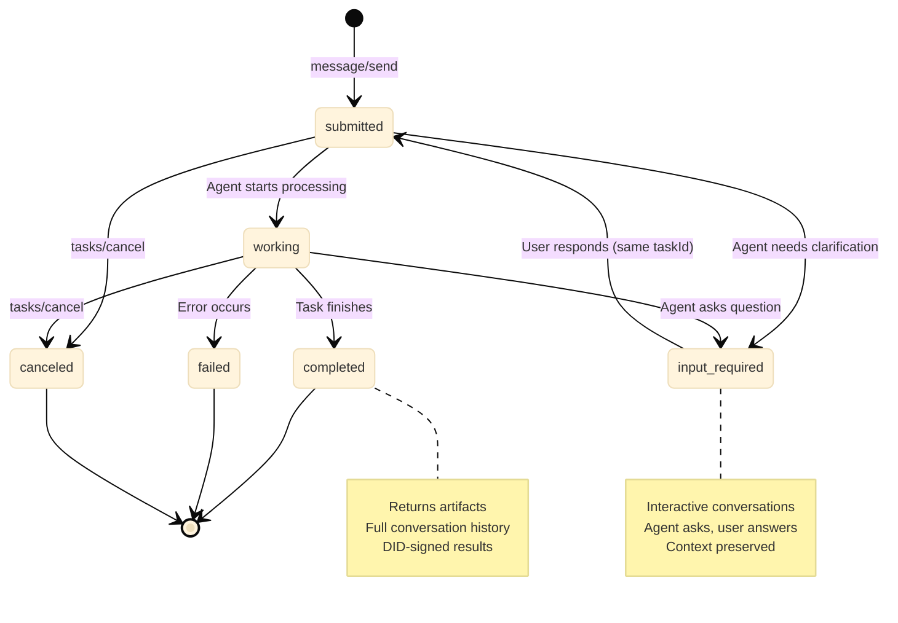

---
title: "Built for the Internet of Agents"
description: "The core ideas behind Bindu's protocol-native, task-first agent architecture"
---

Transform any agent into a production-ready server that speaks universal protocols.

## Why These Concepts Matter

Most agent demos stop at a prompt and a response. Real agent systems need a lot more than that. They need discovery, identity, payment rails, task state, observability, storage, and a way to keep conversations alive across turns.

| A Basic Agent Wrapper | Bindu |
| --- | --- |
| Exposes a model or workflow behind a custom endpoint | Turns an agent into a protocol-native server |
| Usually treats interactions as one-off requests | Treats every interaction as a trackable task |
| Context is often held in app code or lost between calls | Context and history persist across states |
| Payments and auth are bolted on later | X402, DID, and auth fit into the request path |
| Observability is added separately | Phoenix, Langfuse, and Jaeger tracing are built in |

That is the real shift: Bindu is not just a wrapper around an agent framework. It gives the agent the infrastructure it needs to operate on the Internet of Agents.

<Note>
Bindu is built around the idea that agent infrastructure should not be stitched together by hand every time. Discovery, task state, routing, identity, and execution all need to work as one system.
</Note>

## How Bindu Works

Bindu turns your agent into a server that can be discovered, called, authenticated, paid, traced, and resumed. The request path is protocol-native from the first message to the final artifact.

### The System Flow



<CardGroup cols={3}>
  <Card title="Protocol-Native" icon="globe">
    Bindu speaks A2A, AP2, and X402 without making you invent your own transport layer first.
  </Card>
  <Card title="Task-First" icon="list-checks">
    Every interaction becomes a trackable task with clear state, history, and lifecycle transitions.
  </Card>
  <Card title="Production-Ready" icon="server">
    Identity, payments, storage, scheduling, and tracing fit into the execution path from the start.
  </Card>
</CardGroup>

### The Lifecycle: Discovery, Execution, Completion



<Steps>
  <Step title="Discovery">
    Client finds agents via `/agent/skills` endpoint.
  </Step>

  <Step title="Execution">
    Send message via `message/send` -> Task enters **"submitted"** state. X402 verifies payment if required. Auth0 + DID verify identity. Task moves to **"working"** state, and the agent executes.
  </Step>

  <Step title="Completion">
    If the agent needs input, task enters **"input-required"** state. When processing finishes, task reaches **"completed"** state with artifacts. Full trace is captured via Phoenix, Langfuse, and Jaeger.
  </Step>
</Steps>

---

## Task Lifecycle And States

Bindu uses a **task-first pattern** where every interaction is a trackable, resumable task with persistent state:



| State | Description | Can Cancel? | Next Actions |
| --- | --- | --- | --- |
| **`submitted`** | Task received, queued for processing | Yes | Wait or poll with `tasks/get` |
| **`working`** | Agent actively processing | Yes | Wait for completion or input request |
| **`input-required`** | Agent needs user input to continue | Yes | Send follow-up message with same `taskId` |
| **`completed`** | Task finished successfully | No | Retrieve artifacts, submit feedback |
| **`failed`** | Task encountered an error | No | Check error details, retry if needed |
| **`canceled`** | Task was canceled by user | No | Create new task if needed |

Each part of that lifecycle solves a real problem:

- **Resumable Conversations**: Tasks can pause for user input and resume seamlessly
- **Context Preservation**: Full conversation history maintained across all states
- **Reference Previous Tasks**: Use `referenceTaskIds` to build on prior results
- **Async by Default**: Submit task, get immediate response, poll for completion
- **Artifact Storage**: Final results stored with DID signatures for verification

<CodeGroup>
  ```python Example Flow
  # 1. Submit task
  response = await agent.send_message("create sunset caption")
  # State: "submitted" -> "input-required"
  # Agent asks: "Which platform? Instagram, Pinterest, or General?"

  # 2. Check status
  task = await agent.get_task(task_id)
  # State: "input-required"
  # History shows agent's question

  # 3. Respond to agent (same taskId, new messageId)
  response = await agent.send_message("Instagram", task_id=task_id)
  # State: "submitted" -> "working" -> "completed"

  # 4. Get final result
  task = await agent.get_task(task_id)
  # State: "completed"
  # Artifacts: ["Chasing sunsets and dreams. 🌅 #SunsetLovers"]

  # 5. Build on previous result (new task, reference old one)
  response = await agent.send_message(
      "make it shorter",
      reference_task_ids=[task_id]
  )
  # Agent accesses previous caption and shortens it
  # Result: "Sunset vibes. 🌅 #GoldenHour"
  ```
</CodeGroup>

<Note>
Unlike stateless APIs, Bindu preserves the whole conversation context. Agents can ask clarifying questions, users can respond on the same task, and later tasks can build on earlier results.
</Note>

## Protocol-Native Architecture

The architecture is built around open agent protocols and real execution infrastructure, not just a model call behind an endpoint.

<CardGroup cols={2}>
  <Card title="Universal Protocol Support" icon="git-branch">
    Native <a href="https://github.com/a2aproject/A2A">A2A</a>, <a href="https://github.com/google-agentic-commerce/AP2">AP2</a>, and <a href="https://github.com/coinbase/x402">X402</a> compliance out of the box.
  </Card>
  <Card title="Framework Agnostic" icon="blocks">
    Works with <a href="https://github.com/agno-agi/agno">Agno</a>, <a href="https://github.com/langchain-ai/langchain">LangChain</a>, <a href="https://github.com/crewAIInc/crewAI">CrewAI</a>, <a href="https://developers.llamaindex.ai/python/framework/use_cases/agents/">LlamaIndex</a>, <a href="https://github.com/evalstate/fast-agent">FastAgent</a>, and any Python-based framework.
  </Card>
  <Card title="DID Authentication" icon="shield-check">
    Built-in Decentralized Identity for secure agent-to-agent communication. Influenced by <a href="https://atproto.com/specs/did">AT Protocol DID structure</a>.
  </Card>
  <Card title="Type Safe" icon="braces">
    Enforce structured I/O through schema validation for predictable behavior.
  </Card>
</CardGroup>

## Infrastructure And Deployment

Infrastructure is part of the core model here, not an afterthought.

<AccordionGroup>
  <Accordion title="Simple Server Setup">
    Turn your AI agent into <a href="https://github.com/getbindu/Bindu/blob/main/bindu/server/applications.py">a web server using Starlette (a Python web framework)</a>. The `BinduApplication` class handles all the complex setup. You just provide your agent and it creates a fully functional server ready to receive requests.
  </Accordion>

  <Accordion title="Built-In Reliability">
    Comes with automatic error handling, task retry mechanisms, health checks, and backup systems. If something fails, <a href="https://github.com/getbindu/Bindu/blob/main/bindu/server/task_manager.py">Bindu knows how to recover gracefully without crashing your agent</a>.
  </Accordion>

  <Accordion title="Run Anywhere">
    Start on your local machine (localhost) and deploy to any cloud platform when ready. <a href="https://github.com/getbindu/create-bindu-agent/blob/main/%7B%7Bcookiecutter.project_name%7D%7D/docker-compose.yml">Works with Docker and Podman containers</a>, making it easy to package and ship your agent to production environments.
  </Accordion>

  <Accordion title="Observability And Monitoring">
    Native integration with Phoenix, Langfuse, and Jaeger for complete visibility. Track agent health, performance metrics, execution flows, and distributed-system errors in one place.
  </Accordion>
  
  <Accordion title="Storage And Orchestration">
    Choose between in-memory, PostgreSQL, or Redis for context and history. Redis-based scheduler coordinates tasks across agent instances. Analyze tasks and route to agents based on capabilities and availability, with sequential, parallel, or collaborative execution patterns.
  </Accordion>

  <Accordion title="Payment And Commerce">
    Native support for agent-to-agent payments and micropayments through X402. AP2 support lets agents participate in agentic commerce ecosystems.
  </Accordion>

  <Accordion title="Security And Privacy">
    Support for AuthKit, GitHub, AWS Cognito, Google, and Azure. Runs in your infrastructure with a private-by-default model and no external data sharing or vendor lock-in.
  </Accordion>
</AccordionGroup>

## Developer Experience

Good infrastructure only helps if developers can actually use it without spending a week wiring the basics together.

<CardGroup cols={2}>
  <Card title="2-Minute Setup" icon="rocket">
    Production-ready agent with `create-bindu-agent` cookiecutter template.
  </Card>
  <Card title="Best Practices Built-In" icon="check-circle">
    Pre-configured with ruff, ty, pytest, and pre-commit hooks.
  </Card>
  <Card title="113+ Built-In Toolkits" icon="tool">
    Access thousands of tools across data, code, web, and enterprise APIs.
  </Card>
  <Card title="MCP Integration" icon="plug">
    First-class Model Context Protocol support to connect agents with external systems.
  </Card>
</CardGroup>

---

## Related

- /bindu/introduction/what-is-bindu
- /bindu/concepts/architecture
- /bindu/concepts/task-first-pattern
- /bindu/how-to/install

---

<span className="brand-quote">
  

  <span className="brand-quote-text">
    Bindu gives your agents the infrastructure they need to{" "}
    <span className="brand-quote-highlight">
      discover, act, remember, and coordinate
    </span>
    , without making you rebuild the plumbing every time.
  </span>
</span>

