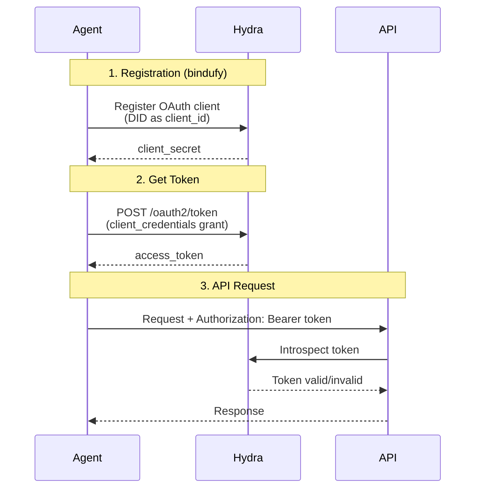

When agents are local and short-lived, open access feels harmless. The moment an agent becomes a real network participant, that assumption breaks. You need a way to prove who is calling, what they are allowed to do, and whether a token should still be trusted when it reaches the API boundary.

Without authentication, access control becomes fragile. Protected methods can be exposed too broadly, tokens cannot be validated consistently, and the agent loses a clean trust boundary between caller and execution.

## Why Authentication Matters

In an agent network, trust should not depend on a hidden allowlist or a private convention. A caller needs a standard way to obtain credentials, present them, and be checked before access is granted.

| Unauthenticated access | Bindu authentication |
| --- | --- |
| Easy for local testing | Safer for production access control |
| No formal identity at request time | OAuth2 tokens define who is calling |
| Hard to apply consistent policy | Hydra provides a standard token workflow |
| Weak boundary between caller and API | Requests are checked before protected actions run |
| Fine for experiments | Better for networked and production agents |

That is the shift: Bindu uses Ory Hydra so agents can participate in a standard OAuth2 flow, obtain access tokens, and enforce protected access with a clear trust boundary.

<Note>
If an agent is exposed beyond local development, it should not rely on obscurity for security. It should be able to verify who is calling before sensitive work begins.
</Note>

## How Bindu Authentication Works

Bindu uses **Ory Hydra** as its authentication backend for production deployments. Authentication is optional, so you can still run agents without it for development and testing.

### The Authentication Model

Bindu uses a straightforward token flow:

```text
register client -> obtain token -> call API with bearer token
```

Example flow:

```text
agent identity -> Hydra client -> access token -> authenticated request
```

The model is easy to reason about:

- the agent is registered as an OAuth client
- Hydra issues a `client_secret`
- the caller exchanges credentials for an access token
- the token is sent with the API request and validated before access

<CardGroup cols={3}>
  <Card title="Standard" icon="badge-check">
    Authentication follows an OAuth2 client credentials flow instead of a custom ad hoc scheme.
  </Card>
  <Card title="Scoped" icon="key">
    Access tokens carry explicit scopes such as `agent:read` and `agent:write`.
  </Card>
  <Card title="Verifiable" icon="shield-check">
    Tokens can be introspected against Hydra so access decisions are made with a trusted source of truth.
  </Card>
</CardGroup>

### The Lifecycle: Register, Mint, Verify

Let's break the flow down first, then walk through each stage.



What this means is simple: Bindu turns agent access into a repeatable trust flow instead of a custom one-off secret exchange.

<Steps>
  <Step title="Register">
    During `bindufy`, the agent is registered with Hydra as an OAuth client, using the DID as the `client_id`. Hydra returns the `client_secret` needed for future token requests.

    This matters because the agent now has a formal identity inside the authentication system instead of being treated like an anonymous caller.
  </Step>

  <Step title="Mint">
    When you deploy your agent, obtain an access token using the OAuth2 client credentials flow.

    <CodeGroup>
      ```bash Request
      curl -X POST https://hydra.getbindu.com/oauth2/token \
        -H "Content-Type: application/x-www-form-urlencoded" \
        -d "grant_type=client_credentials" \
        -d "client_id=did:bindu:<YOUR_AGENT_DID>" \
        -d "client_secret=<YOUR_CLIENT_SECRET>" \
        -d "scope=openid offline agent:read agent:write"
      ```

      ```json Response
      {
        "access_token": "eyJhbGciOiJSUzI1NiIsInR5cCI6IkpXVCJ9...",
        "expires_in": 3600,
        "scope": "openid offline agent:read agent:write",
        "token_type": "bearer"
      }
      ```
    </CodeGroup>

    Your credentials come from two places:

    - **Agent DID**: Found in the agent card at `/.well-known/agent.json`
    - **Client Secret**: Located in `.bindu/oauth_credentials.json` file
  </Step>

  <Step title="Verify">
    Include the access token in the `Authorization` header for all API requests. The API validates the token before allowing protected operations to continue.

    ```bash
    curl --location 'http://localhost:3773/' \
    --header 'Content-Type: application/json' \
    --header 'Authorization: Bearer <your-access-token>' \
    --data '{
        "jsonrpc": "2.0",
        "method": "message/send",
        "params": {
            "message": {
                "role": "user",
                "content": "Hello!"
            }
        },
        "id": 1
    }'
    ```

    The result is a protected request path where identity is checked before execution, not guessed after the fact.
  </Step>
</Steps>

## Configuration

Authentication should be easy to enable when you need it and easy to avoid when you do not. Bindu keeps the configuration surface intentionally small.

### Environment Variables

Configure Hydra connection via environment variables (see `.env.example`):

```bash
# Enable authentication
AUTH__ENABLED=true

# Set provider to Hydra (only supported provider)
AUTH__PROVIDER=hydra

# Hydra endpoints
HYDRA__ADMIN_URL=https://hydra-admin.getbindu.com
HYDRA__PUBLIC_URL=https://hydra.getbindu.com
```

Configuration options:

- `AUTH__ENABLED`: Set to `true` to enable authentication
- `AUTH__PROVIDER`: Must be `hydra` (only supported provider)
- `HYDRA__ADMIN_URL`: Hydra Admin API endpoint for client management
- `HYDRA__PUBLIC_URL`: Hydra Public API endpoint for token operations

### Agent Configuration

No additional configuration is needed in your agent code. Authentication is handled automatically when environment variables are set.

This is deliberate. Your agent definition stays focused on behavior, while the environment decides whether the runtime should enforce authentication.

### Standards

<CardGroup cols={3}>
  <Card title="OAuth2" icon="key">
    Hydra uses the OAuth2 client credentials flow so agents can obtain tokens through a standard authentication model.
  </Card>
  <Card title="Ory Hydra" icon="shield">
    Hydra acts as the centralized authority for client registration, token minting, and token validation.
  </Card>
  <Card title="Scoped Access" icon="sliders">
    Scopes like `openid`, `offline`, `agent:read`, and `agent:write` keep access explicit.
  </Card>
</CardGroup>

## Getting Access Tokens

There are two practical ways to get a token depending on whether you want direct API control or a simpler testing workflow.

### Method 1: API Request

Use the OAuth2 token endpoint directly when you want explicit control over the authentication flow:

```bash
curl -X POST https://hydra.getbindu.com/oauth2/token \
  -H "Content-Type: application/x-www-form-urlencoded" \
  -d "grant_type=client_credentials" \
  -d "client_id=did:bindu:<YOUR_AGENT_DID>" \
  -d "client_secret=<YOUR_CLIENT_SECRET>" \
  -d "scope=openid offline agent:read agent:write"
```

### Method 2: UI (Recommended for Testing)

Use the frontend UI to obtain tokens easily:

1. Start the frontend:

   ```bash
   cd frontend
   npm run dev
   ```

2. Navigate to: **Settings → Authentication**

3. Enter your `CLIENT_SECRET` (from `.bindu/oauth_credentials.json`)

4. Click **Get Access Token**

5. Copy the generated token

The difference is simple: the API path is better for explicit automation, while the UI path is easier when you are manually testing.

## The Value Of Authenticated Access

Authentication only matters if it creates a cleaner and safer trust boundary.

This model gives you:

- **controlled access** - protected methods are no longer open by default
- **standardized identity checks** - tokens flow through a well-known OAuth2 model
- **clearer trust boundaries** - the API can validate who is calling before sensitive work starts

This is the point of the whole model: as agents move into real environments, access should become explicit and inspectable instead of informal and fragile.

## Real-World Use Cases

<AccordionGroup>
  <Accordion title="Protected production agents">
    When an agent is exposed publicly or shared across teams, Hydra-backed authentication ensures only token-bearing callers can reach protected functionality.

    ```bash
    AUTH__ENABLED=true
    AUTH__PROVIDER=hydra
    ```
  </Accordion>

  <Accordion title="Automated service-to-service access">
    If one service or agent needs to call another automatically, the client credentials flow gives it a clean way to request an access token programmatically.

    ```bash
    curl -X POST https://hydra.getbindu.com/oauth2/token \
      -H "Content-Type: application/x-www-form-urlencoded" \
      -d "grant_type=client_credentials" \
      -d "client_id=did:bindu:<YOUR_AGENT_DID>" \
      -d "client_secret=<YOUR_CLIENT_SECRET>" \
      -d "scope=openid offline agent:read agent:write"
    ```
  </Accordion>

  <Accordion title="Frontend-assisted testing">
    During local or pre-production testing, the frontend UI gives developers a faster path to token generation without manually crafting every request.

    ```bash
    cd frontend
    npm run dev
    ```
  </Accordion>
</AccordionGroup>

## Security Best Practices

<CardGroup cols={2}>
  <Card title="Keep Client Secrets Private" icon="lock">
    Treat `.bindu/oauth_credentials.json` as sensitive material and never expose the `client_secret` publicly.
  </Card>
  <Card title="Use Scopes Deliberately" icon="badge-check">
    Request only the scopes you actually need so access remains narrow and explicit.
  </Card>
</CardGroup>

---

## Related

* https://www.ory.sh/hydra/
* https://oauth.net/2/
* /bindu/learn/did/overview

---

<span className="brand-quote">
  

  <span className="brand-quote-text">
    Bindu helps agents prove who they are -{" "}
    <span className="brand-quote-highlight">
      each one independent
    </span>
    , making it easy to verify and trust across the Internet of Agents.
  </span>
</span>
