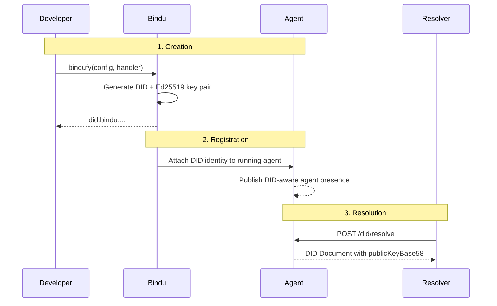

---

title: "Decentralized Identifiers (DIDs)"
description: "Secure, verifiable, and self-sovereign identity for AI agents"
---

API keys work fine when one platform owns the whole flow. They work a lot less well when agents talk to each other across different systems, teams, and networks.

Here’s the catch. In a decentralized Agent-to-Agent setup, identity should not disappear because a provider is down, a dashboard changes, or one integration gets revoked. If an agent sends a payment instruction or a sensitive payload, the receiver needs a way to verify who sent it without trusting a central service.

## Why Agent Identity Needs A Better Model

Most agent systems still inherit the assumptions of centralized SaaS:

- Identity is issued by a provider
- Trust is delegated to a platform
- Secrets are copied across environments
- Verification depends on infrastructure someone else controls

In a decentralized network, that is not enough. An agent needs an identity that survives platform changes, crosses system boundaries, and can be verified cryptographically by anyone who receives a message.

<Note>
If one agent sends a high-value payload to another, the receiving system should not have to trust a vendor, a dashboard, or a hostname. It should be able to verify the sender mathematically.
</Note>

## What We Actually Need

Bindu gives each agent a self-sovereign cryptographic identity that is:

- Globally unique
- Independent of a central authority
- Backed by public/private key cryptography
- Persistent across platforms and time
- Verifiable by any participant in the network

That identity is a **Decentralized Identifier (DID)**.

## How Bindu DIDs Work

Bindu uses **Decentralized Identifiers (DIDs)** to provide secure, verifiable, and self-sovereign identity for AI agents. Each agent gets a unique DID that serves as its cryptographic identity across the network.

### The W3C Format

Bindu uses a readable DID structure:

```
did:bindu:<email>:<agent_name>:<unique_hash>
```

Example:

```
did:bindu:gaurikasethi88_at_gmail_com:echo_agent:352c17d030fb4bf1ab33d04b102aef3d
```

The structure is readable to developers and precise for machines:

- `did` declares the identifier type
- `bindu` is the DID method
- `<email>` and `<agent_name>` make the identity human-legible
- `<unique_hash>` ensures uniqueness at the cryptographic edge

<CardGroup cols={3}>
  <Card title="Self-Sovereign" icon="fingerprint">
    No single provider owns the identity or decides whether it is valid.
  </Card>
  <Card title="Verifiable" icon="shield-check">
    Public keys in the DID Document let any verifier check signatures independently.
  </Card>
  <Card title="Persistent" icon="globe">
    The DID remains the agent's identity across deployments, integrations, and time.
  </Card>
</CardGroup>

### The Lifecycle: Creation, Registration, Resolution

Under the hood, every Bindu DID moves through three practical stages:

1. **Creation**: `bindufy()` generates the agent identity and its Ed25519 key material.
2. **Registration**: the running Bindu agent publishes that identity as part of its verifiable network presence.
3. **Resolution**: other systems request the DID Document and inspect its public verification data.



### Creation Is Frictionless

When you create a Bindu agent, a DID is automatically generated:

```python
config = {
    "author": "your.email@example.com",
    "name": "my_agent",
    "description": "My AI agent"
}

bindufy(config, handler)
# DID generated: did:bindu:your_email_at_example_com:my_agent:<hash>
```

Think of it like this: `bindufy()` does the identity setup for you, so you do not have to manage key generation and DID wiring by hand.

### Resolution Is Explicit

You can retrieve an agent’s public identity (DID Document) using:

```bash
curl -X POST http://localhost:3773/did/resolve \
  -H "Content-Type: application/json" \
  -d '{
    "did": "did:bindu:gaurikasethi88_at_gmail_com:echo_agent:352c17d030fb4bf1ab33d04b102aef3d"
  }'
```

Resolution gives any participant the public metadata needed to verify the agent.

### DID Document Structure

The DID Document is the public record behind the identifier:

```json
{
  "id": "did:bindu:...",
  "created": "2026-02-11T05:33:56.969079+00:00",
  "authentication": [
    {
      "type": "Ed25519VerificationKey2020",
      "publicKeyBase58": "<public-key>"
    }
  ]
}
```

This document contains the public key used to verify the agent’s identity.

---

## Message Signing

Agents sign responses with their private key. The signature is included in task response metadata:

```json
{
  "artifacts": [
    {
      "parts": [
        {
          "kind": "text",
          "text": "The capital of India is **New Delhi**.",
          "metadata": {
            "did.message.signature": "<base58-signature>"
          }
        }
      ]
    }
  ]
}
```

Each field has a specific job:

- `@context` anchors the document in the W3C DID data model plus Bindu's namespace
- `id` is the canonical DID for the agent
- `created` records when the identity was established
- `authentication` lists the verification methods used to prove control of the DID
- `publicKeyBase58` exposes the public key in Base58 form for signature verification

<Note>
Bindu uses the `Ed25519VerificationKey2020` verification method. That gives agents compact, fast public-key signatures that fit machine-to-machine traffic well.
</Note>

### Standards

<CardGroup cols={3}>
  <Card title="W3C DID Core" icon="book-open" href="https://www.w3.org/TR/did-core/">
    The core data model and rules that define how decentralized identifiers work.
  </Card>
  <Card title="DID Method Registry" icon="list-tree" href="https://www.w3.org/TR/did-spec-registries/">
    The registry for DID methods and related verification method conventions.
  </Card>
  <Card title="Ed25519 / RFC 8032" icon="key-round">
    The signature scheme Bindu uses for agent identity and message verification.
  </Card>
</CardGroup>

## What You Get From Signing

Identity only matters if it holds up when a message is received, checked, and acted on.

---

## Security Best Practices

This signature proves:

- **Authenticity** - Message came from the agent with this DID
- **Integrity** - Message hasn't been tampered with
- **Non-repudiation** - Agent cannot deny sending the message

This is the point of the whole model: trust becomes a verification step instead of an assumption.

## Real-World Use Cases

<AccordionGroup>
  <Accordion title="Agent-to-agent financial workflows">
    When an agent submits payment instructions, quotes, or settlement data, the receiving system can verify exactly which DID signed the payload before executing a high-value action.
  </Accordion>
  <Accordion title="Cross-organization agent collaboration">
    Teams can run agents across different clouds, companies, and security boundaries while preserving verifiable identity without relying on one shared platform authority.
  </Accordion>
  <Accordion title="Auditable automation in regulated systems">
    Signed outputs create a stronger audit trail for environments where provenance matters, including finance, healthcare, and enterprise workflow approval chains.
  </Accordion>
  <Accordion title="Agent discovery with trust attached">
    A DID alone is not just an address. Once resolved to a DID Document, it becomes a trust anchor that other agents and services can inspect before they communicate.
  </Accordion>
</AccordionGroup>

## Security Best Practices

<CardGroup cols={2}>
  <Card title="Protect Private Keys" icon="lock">
    Never hardcode keys in code. Don't commit keys to version control. Use secure key storage solutions. Back up keys securely.
  </Card>
  <Card title="Rotate Keys Deliberately" icon="refresh-cw">
    Rotate keys every 90-180 days. Update after team changes. Follow compliance requirements.
  </Card>
</CardGroup>

## Related

* https://bindus.directory
* https://atproto.com/specs/did
