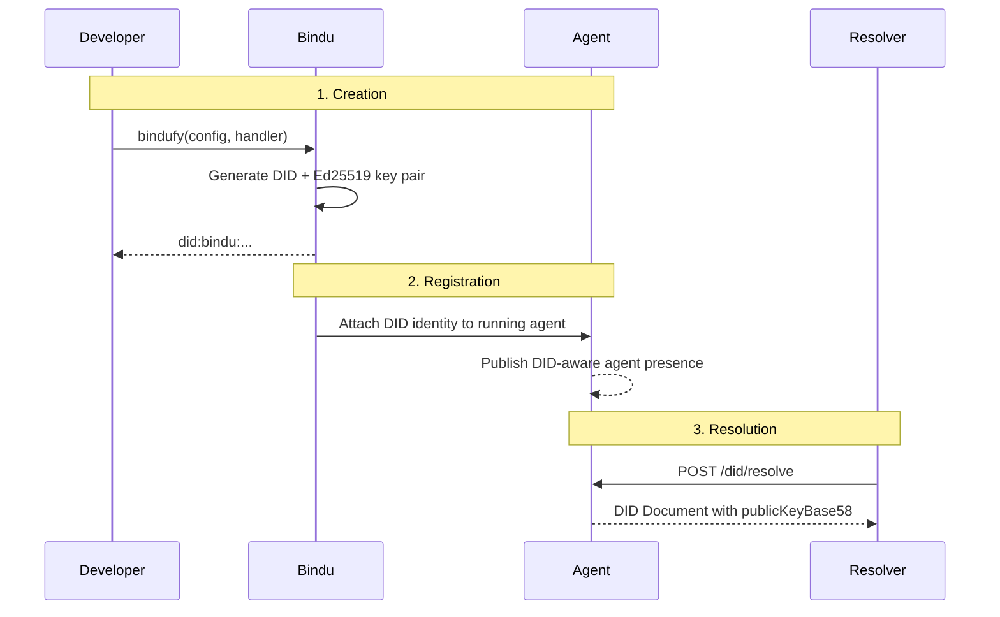

API keys work fine when one platform owns the whole flow. They work a lot less well when agents talk to each other across different systems, teams, and networks.

## Why DIDs Matter

In a decentralized Agent-to-Agent setup, identity should not disappear because a provider is down, a dashboard changes, or one integration gets revoked. If an agent sends a payment instruction or a sensitive payload, the receiver needs a way to verify who sent it without trusting a central service.

| Traditional API Keys | Bindu DIDs |
| --- | --- |
| Issued and controlled by a provider | Self-sovereign and independent of a central authority |
| Trust is delegated to a platform | Trust is verified cryptographically |
| Secrets are copied across environments | Public verification data can be shared safely |
| Identity breaks when integrations or dashboards change | Identity persists across platforms and time |
| Verification depends on infrastructure someone else controls | Any participant can verify the agent directly |

That is the shift: Bindu gives each agent a globally unique, cryptographic identity that remains verifiable across systems. That identity is a **Decentralized Identifier (DID)**.

<Note>
If one agent sends a high-value payload to another, the receiving system should not have to trust a vendor, a dashboard, or a hostname. It should be able to verify the sender mathematically.
</Note>

## How Bindu DIDs Work

Bindu uses **Decentralized Identifiers (DIDs)** to provide secure, verifiable, and self-sovereign identity for AI agents. Each agent gets a unique DID that serves as its cryptographic identity across the network.

### The W3C Format

Bindu uses a readable DID structure:

```text
did:bindu:<email>:<agent_name>:<unique_hash>
```

Example:

```text
did:bindu:gaurikasethi88_at_gmail_com:echo_agent:352c17d030fb4bf1ab33d04b102aef3d
```

The structure is readable to developers and precise for machines:

- `did` declares the identifier type
- `bindu` is the DID method
- `<email>` and `<agent_name>` make the identity human-legible
- `<unique_hash>` ensures uniqueness at the cryptographic edge

<CardGroup cols={3}>
  <Card title="Self-Sovereign" icon="fingerprint">
    No single provider owns the identity or decides whether it is valid.
  </Card>
  <Card title="Verifiable" icon="shield-check">
    Public keys in the DID Document let any verifier check signatures independently.
  </Card>
  <Card title="Persistent" icon="globe">
    The DID remains the agent's identity across deployments, integrations, and time.
  </Card>
</CardGroup>

### The Lifecycle: Creation, Registration, Resolution

Under the hood, every Bindu DID moves through three practical stages.



<Steps>
  <Step title="Creation">
    `bindufy()` generates the DID and its Ed25519 key material automatically when you create a Bindu agent.

    ```python
    config = {
        "author": "your.email@example.com",
        "name": "my_agent",
        "description": "My AI agent"
    }

    bindufy(config, handler)
    # DID generated: did:bindu:your_email_at_example_com:my_agent:<hash>
    ```

    Think of it like this: `bindufy()` does the identity setup for you, so you do not have to manage key generation and DID wiring by hand.
  </Step>

  <Step title="Registration">
    Once created, the running Bindu agent publishes that DID as part of its verifiable network presence. This is what makes the agent discoverable and identifiable across environments without relying on a single platform authority.
  </Step>

  <Step title="Resolution">
    Other systems can request the DID Document and inspect the public verification data needed to validate the agent.

    <CodeGroup>
      ```bash Request
      curl -X POST http://localhost:3773/did/resolve \
        -H "Content-Type: application/json" \
        -d '{
          "did": "did:bindu:gaurikasethi88_at_gmail_com:echo_agent:352c17d030fb4bf1ab33d04b102aef3d"
        }'
      ```

      ```json Response
      {
        "id": "did:bindu:...",
        "created": "2026-02-11T05:33:56.969079+00:00",
        "authentication": [
          {
            "type": "Ed25519VerificationKey2020",
            "publicKeyBase58": "<public-key>"
          }
        ]
      }
      ```
    </CodeGroup>

    Resolution gives any participant the public metadata needed to verify the agent. The DID Document is the public record behind the identifier, and it contains the public key used to verify the agent's identity.
  </Step>
</Steps>

---

## Message Signing

Agents sign responses with their private key. The signature is included in task response metadata:

```json
{
  "artifacts": [
    {
      "parts": [
        {
          "kind": "text",
          "text": "The capital of India is **New Delhi**.",
          "metadata": {
            "did.message.signature": "<base58-signature>"
          }
        }
      ]
    }
  ]
}
```

Each field has a specific job:

- `@context` anchors the document in the W3C DID data model plus Bindu's namespace
- `id` is the canonical DID for the agent
- `created` records when the identity was established
- `authentication` lists the verification methods used to prove control of the DID
- `publicKeyBase58` exposes the public key in Base58 form for signature verification

<Note>
Bindu uses the `Ed25519VerificationKey2020` verification method. That gives agents compact, fast public-key signatures that fit machine-to-machine traffic well.
</Note>

### Standards

<CardGroup cols={3}>
  <Card title="W3C DID Core" icon="book-open" href="https://www.w3.org/TR/did-core/">
    The core data model and rules that define how decentralized identifiers work.
  </Card>
  <Card title="DID Method Registry" icon="list-tree" href="https://www.w3.org/TR/did-spec-registries/">
    The registry for DID methods and related verification method conventions.
  </Card>
  <Card title="Ed25519 / RFC 8032" icon="key" href="https://www.rfc-editor.org/rfc/rfc8032">
    The signature scheme Bindu uses for agent identity and message verification.
  </Card>
</CardGroup>

## The Value of Cryptographic Signatures

Identity only matters if it holds up when a message is received, checked, and acted on.

This signature proves:

- **Authenticity** - Message came from the agent with this DID
- **Integrity** - Message hasn't been tampered with
- **Non-repudiation** - Agent cannot deny sending the message

This is the point of the whole model: trust becomes a verification step instead of an assumption.

## Real-World Use Cases

<AccordionGroup>
  <Accordion title="Agent-to-agent financial workflows">
    When an agent submits payment instructions, quotes, or settlement data, the receiving system can verify exactly which DID signed the payload before executing a high-value action.

    ```python
    import nacl.signing
    import base58

    def verify_financial_payload(payload_bytes, signature_b58, agent_did):
        # 1. Resolve the sending agent's DID to get their public key
        did_doc = resolve_did(agent_did)
        public_key_b58 = did_doc["authentication"][0]["publicKeyBase58"]
        public_key = nacl.signing.VerifyKey(base58.b58decode(public_key_b58))

        # 2. Verify the payload hasn't been tampered with
        try:
            public_key.verify(payload_bytes, base58.b58decode(signature_b58))
            print("✓ Payment instruction verified. Safe to execute.")
            return True
        except nacl.exceptions.BadSignatureError:
            print("✗ Invalid signature! Rejecting high-value action.")
            return False
    ```
  </Accordion>

  <Accordion title="Cross-organization agent collaboration">
    Teams can run agents across different clouds, companies, and security boundaries while preserving verifiable identity without relying on one shared platform authority.

    ```python
    async def verify_external_agent_response(task_response, expected_did):
        # Extract message and cryptographic signature from cross-cloud response
        artifact = task_response["result"]["artifacts"][0]
        message_text = artifact["parts"][0]["text"]
        signature = artifact["parts"][0]["metadata"]["did.message.signature"]

        # Resolve external DID directly from the decentralized network
        did_doc = await resolve_did(expected_did)
        pub_key_b58 = did_doc["authentication"][0]["publicKeyBase58"]
        public_key = nacl.signing.VerifyKey(base58.b58decode(pub_key_b58))

        # Validate identity across boundaries without a central intermediary
        public_key.verify(message_text.encode('utf-8'), base58.b58decode(signature))
        print("✓ Identity and integrity verified across organizations.")
    ```
  </Accordion>

  <Accordion title="Auditable automation in regulated systems">
    Signed outputs create a stronger audit trail for environments where provenance matters, including finance, healthcare, and enterprise workflow approval chains.

    ```python
    from datetime import datetime

    def log_compliant_action(agent_did, action_data, signature_b58):
        # Verify the signature before adding it to the permanent record
        if verify_agent_signature(agent_did, action_data, signature_b58):
            audit_entry = {
                "timestamp": datetime.utcnow().isoformat(),
                "agent_did": agent_did,
                "action": action_data,
                "signature": signature_b58 # Immutable cryptographic proof
            }
            database.audit_logs.insert(audit_entry)
            print("✓ Action securely logged for compliance audit.")
        else:
            raise SecurityError("Unverified action rejected from audit log.")
    ```
  </Accordion>

  <Accordion title="Agent discovery with trust attached">
    A DID alone is not just an address. Once resolved to a DID Document, it becomes a trust anchor that other agents and services can inspect before they communicate.

    ```python
    import httpx
    from datetime import datetime

    async def discover_trusted_agent(required_skill):
        # Find agents claiming to have the needed skill
        response = await httpx.get(f"[https://getbindu.com/api/agents?skill=](https://getbindu.com/api/agents?skill=){required_skill}")
        candidate_agent = response.json()["agents"][0]

        # Resolve DID to establish the trust anchor
        did_doc = await resolve_did(candidate_agent["did"])
        created_date = datetime.fromisoformat(did_doc["created"])
        
        print(f"Discovered: {candidate_agent['name']}")
        print(f"Trust Anchor (DID): {candidate_agent['did']}")
        print(f"Identity Established Since: {created_date.strftime('%Y-%m-%d')}")
        
        return candidate_agent
    ```
  </Accordion>
</AccordionGroup>

## Security Best Practices

<CardGroup cols={2}>
  <Card title="Protect Private Keys" icon="lock">
    Never hardcode keys in code. Don't commit keys to version control. Use secure key storage solutions. Back up keys securely.
  </Card>
  <Card title="Rotate Keys Deliberately" icon="rotate">
    Rotate keys every 90-180 days. Update after team changes. Follow compliance requirements.
  </Card>
</CardGroup>

---

## Related

* https://www.getbindu.com
* https://atproto.com/specs/did

---

<span className="brand-quote">
  

  <span className="brand-quote-text">
    Bindu lets your agents stand{" "}
    <span className="brand-quote-highlight">
      independent, yet verifiable
    </span>
    , bringing trust and light to the Internet of Agents.
  </span>
</span>
