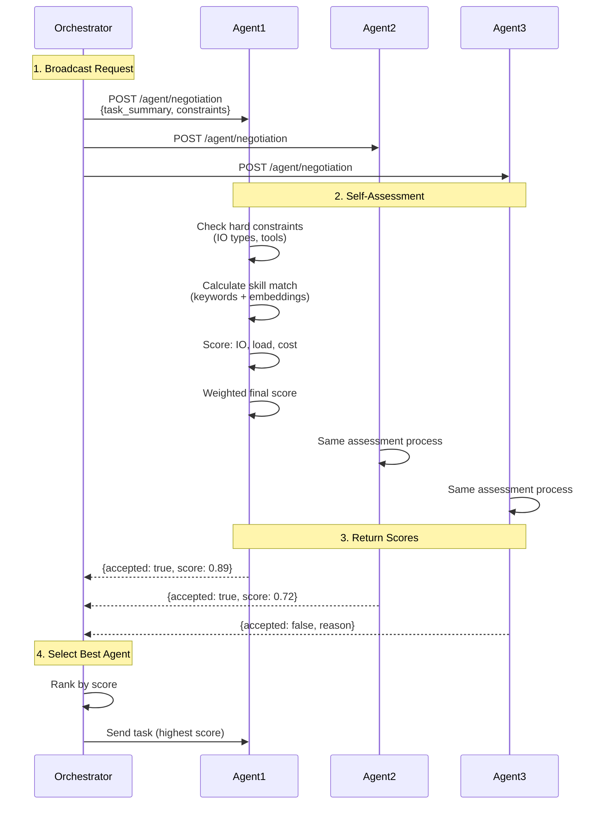

When one agent can do the work, routing is easy. When ten agents can do the work differently, routing becomes a judgment problem. Some are faster. Some are cheaper. Some are overloaded. Some should decline the task entirely.

Without a negotiation layer, orchestration becomes brittle. Tasks get sent to the wrong specialist, quality becomes inconsistent, and cost or latency starts to drift in ways that are hard to control.

## Why Negotiation Matters

In a network of agents, selection should not depend on guesswork or static routing rules alone. An orchestrator needs a way to ask multiple agents, compare their fit, and choose the one most likely to succeed under the current constraints.

| Static routing | Bindu negotiation |
| --- | --- |
| Predefined destination for each task type | Dynamic agent selection based on real conditions |
| Limited awareness of load or cost | Considers skill, performance, load, and cost |
| Hard to adapt when agent quality changes | Agents continuously self-assess for each request |
| Good for simple fixed systems | Better for evolving multi-agent networks |
| Failures often appear late | Weak fits can reject or score themselves lower early |

That is the shift: Bindu lets orchestrators ask agents to evaluate themselves before assigning work, so selection becomes a transparent decision instead of a hidden assumption.

<Note>
If multiple agents might complete the same task, the system should not rely on whichever one is listed first. It should ask who is actually best suited right now.
</Note>

## How Bindu Negotiation Works

Bindu's negotiation system enables orchestrators to query multiple agents and select the best one for a task based on skills, performance, load, and cost.

### The Negotiation Model

Bindu uses a simple decision pattern:

```text
broadcast request -> self-assessment -> ranking -> selection
```

Example flow:

```text
orchestrator request -> agent scoring -> best match chosen
```

The model stays readable to developers while still giving agents room to make nuanced decisions:

- the **orchestrator** asks multiple agents for an assessment
- each **agent** evaluates hard constraints and fit
- the **response** returns acceptance, score, and reasoning
- the **orchestrator** ranks responses and sends the task to the strongest match

<CardGroup cols={3}>
  <Card title="Adaptive" icon="code-branch">
    Agent selection can change per request instead of being fixed in advance.
  </Card>
  <Card title="Explainable" icon="shield-check">
    Responses include scores, subscores, and skill reasoning rather than a black-box yes or no.
  </Card>
  <Card title="Efficient" icon="gauge">
    Orchestrators can avoid weak matches early and send work to the best-fit agent faster.
  </Card>
</CardGroup>

### The Lifecycle: Broadcast, Assess, Select

Let's break the decision flow down before we go deeper.



What this means is simple: negotiation turns agent selection into a structured conversation instead of a blind handoff.

<Steps>
  <Step title="Broadcast">
    The orchestrator sends the same assessment request to multiple candidate agents.

    The request includes the task summary, input and output expectations, latency and cost constraints, and an optional scoring model.

    <CodeGroup>
      ```bash Request
      POST /agent/negotiation
      Content-Type: application/json

      {
        "task_summary": "Extract tables from PDF invoices",
        "task_details": "Process invoice PDFs and extract structured data",
        "input_mime_types": ["application/pdf"],
        "output_mime_types": ["application/json"],
        "max_latency_ms": 5000,
        "max_cost_amount": "0.001",
        "min_score": 0.7,
        "weights": {
          "skill_match": 0.6,
          "io_compatibility": 0.2,
          "performance": 0.1,
          "load": 0.05,
          "cost": 0.05
        }
      }
      ```

      ```text Request Fields
      task_summary - Brief description of the task
      task_details - Detailed requirements (optional)
      input_mime_types - Expected input formats
      output_mime_types - Expected output formats
      max_latency_ms - Maximum acceptable latency
      max_cost_amount - Budget constraint
      min_score - Minimum confidence threshold
      weights - Custom scoring weights (optional)
      ```
    </CodeGroup>

    The fields matter because they tell each agent not just what the task is, but what kind of success the orchestrator actually cares about.
  </Step>

  <Step title="Assess">
    Each agent runs a self-assessment. It first checks hard constraints such as supported tools or input/output compatibility, then scores softer dimensions like fit, performance, load, and cost.

    The weighted formula is:

    ```python
    score = (
        skill_match * 0.6 +        # Primary: capability matching
        io_compatibility * 0.2 +   # Input/output format support
        performance * 0.1 +        # Speed and reliability
        load * 0.05 +              # Current availability
        cost * 0.05                # Pricing
    )
    ```

    This matters because it separates hard failure from relative preference. An agent can reject cleanly, or accept and explain how strong the fit actually is.
  </Step>

  <Step title="Select">
    Agents return acceptance, score, confidence, and supporting reasoning. The orchestrator then ranks the candidates and chooses the best one.

    <CodeGroup>
      ```json Response
      {
        "accepted": true,
        "score": 0.89,
        "confidence": 0.95,
        "skill_matches": [
          {
            "skill_id": "pdf-processing-v1",
            "skill_name": "PDF Processing",
            "score": 0.92,
            "reasons": [
              "semantic similarity: 0.95",
              "tags: pdf, tables, extraction",
              "capabilities: text_extraction, table_extraction"
            ]
          }
        ],
        "matched_tags": ["pdf", "tables", "extraction"],
        "matched_capabilities": ["text_extraction", "table_extraction"],
        "latency_estimate_ms": 2000,
        "queue_depth": 2,
        "subscores": {
          "skill_match": 0.92,
          "io_compatibility": 1.0,
          "performance": 0.85,
          "load": 0.90,
          "cost": 1.0
        }
      }
      ```

      ```text Response Fields
      accepted - Whether agent can handle the task
      score - Overall confidence score (0-1)
      confidence - Agent's self-assessed confidence
      skill_matches - Matched skills with reasoning
      latency_estimate_ms - Expected processing time
      queue_depth - Current task queue size
      subscores - Breakdown of scoring factors
      ```
    </CodeGroup>

    The result is not just a winner. It is a selection decision the orchestrator can inspect and trust.
  </Step>
</Steps>

## Configuration

Negotiation should be simple to enable and expressive enough to be useful. Bindu keeps the surface intentionally small.

### Enable Negotiation

```python
config = {
    "name": "my_agent",
    "skills": ["skills/pdf-processing"],
    "negotiation": {
        "embedding_api_key": os.getenv("OPENROUTER_API_KEY"),
    }
}
```

This configuration matters because skill matching can go beyond exact tags and use semantic similarity when the embedding API key is present.

### Environment Variables

```bash
# API key for semantic matching
OPENROUTER_API_KEY=sk-or-v1-your-key-here
```

### Negotiation Design Principles

<CardGroup cols={3}>
  <Card title="Honest" icon="certificate">
    Agents should score themselves realistically instead of over-claiming capability.
  </Card>
  <Card title="Weighted" icon="scale-balanced">
    Orchestrators can tune weights to favor quality, latency, load, or cost.
  </Card>
  <Card title="Composable" icon="boxes-stacked">
    Negotiation fits naturally into orchestration layers that query many agents at once.
  </Card>
</CardGroup>

## The Value Of Negotiated Routing

Selection only matters if it improves the quality of downstream execution.

This model gives you:

- **better task-agent fit** - work lands on agents that actually match the need
- **clearer tradeoffs** - latency, cost, and load become visible in the decision
- **safer orchestration** - weak matches can reject early instead of failing after assignment

This is the point of the whole model: in a growing network of agents, routing should become more intelligent as complexity rises, not less.

## Real-World Use Cases

<AccordionGroup>
  <Accordion title="Multi-agent translation">
    An orchestrator can query many translation agents at once, compare specialization and queue depth, and send the work to the strongest candidate.

    ```bash
    # Query 10 translation agents
    for agent in translation-agents:
      curl http://$agent:3773/agent/negotiation \
        -d '{"task_summary": "Translate technical manual to Spanish"}'

    # Responses ranked by orchestrator:
    # Agent 1: score=0.98 (technical specialist, queue=2)
    # Agent 2: score=0.82 (general translator, queue=0)
    # Agent 3: score=0.65 (no technical specialization)
    ```
  </Accordion>

  <Accordion title="Cost optimization">
    Negotiation can be used to find the cheapest acceptable agent instead of simply the highest-quality one.

    ```bash
    # Find cheapest agent above quality threshold
    agents = [a for a in query_all_agents(task) if a.score > 0.8]
    cheapest = min(agents, key=lambda a: a.cost)
    ```
  </Accordion>

  <Accordion title="Custom orchestrator selection">
    Orchestrators can collect negotiation responses directly and apply their own business logic before assigning the final task.

    ```python
    import httpx

    async def find_best_agent(task_summary, agent_urls):
        """Query agents and select the best one."""
        responses = []

        async with httpx.AsyncClient() as client:
            for url in agent_urls:
                try:
                    resp = await client.post(
                        f"{url}/agent/negotiation",
                        json={"task_summary": task_summary}
                    )
                    if resp.status_code == 200:
                        responses.append({
                            "url": url,
                            "data": resp.json()
                        })
                except Exception as e:
                    print(f"Agent {url} failed: {e}")

        # Select highest scoring agent
        if not responses:
            return None

        best = max(responses, key=lambda r: r["data"]["score"])
        return best["url"]

    # Usage
    best_agent = await find_best_agent(
        "Extract tables from PDF invoice",
        ["http://agent1:3773", "http://agent2:3773"]
    )
    ```
  </Accordion>
</AccordionGroup>

## Security Best Practices

<CardGroup cols={2}>
  <Card title="Score Honestly" icon="shield">
    Agents should return realistic confidence and capability scores instead of inflating their fit.
  </Card>
  <Card title="Use Thresholds" icon="sliders">
    Orchestrators should set minimum score thresholds and fallback paths instead of accepting every response.
  </Card>
</CardGroup>

---

## Related

* /bindu/learn/scheduler/overview
* /bindu/learn/storage/overview
* /bindu/learn/observability/overview

---

<span className="brand-quote">
  

  <span className="brand-quote-text">
    Bindu enables agents to negotiate like sunflowers{" "}
    <span className="brand-quote-highlight">
      independent in stance
    </span>
    , yet aligned in trust across the Internet of Agents.
  </span>
</span>
