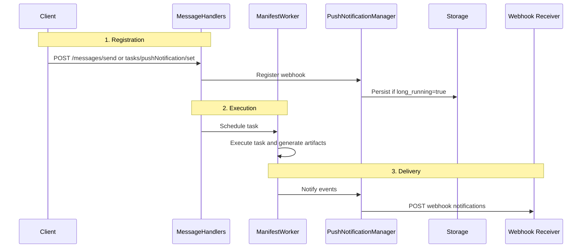

Polling works when a task finishes quickly. It gets clumsy when a task runs for minutes, hours, or days and the client still needs to know what happened without keeping a connection open.

## Why Notifications Matter

The Long-Running Task Notification System gives clients a way to receive webhook notifications for task state changes and artifact generation while the task keeps running in the background. It follows the [A2A Protocol specification](https://a2a-protocol.org/latest/specification/) for push notifications.

| Polling long-running tasks | Bindu push notifications |
| --- | --- |
| Client must keep asking for task status | Server pushes updates as task state changes |
| Long-running jobs waste time waiting between polls | Notifications arrive when work actually changes |
| Artifact delivery depends on another fetch cycle | Artifact events can be sent as soon as they are generated |
| Server restarts can break the client’s tracking flow | Persisted webhook configs let notifications resume |
| Every client implements its own workaround | One notification model works across tasks and agents |

That is the shift: instead of asking the server over and over whether something changed, the client registers a webhook once and gets updates as the task moves forward.

<Note>
This is for tasks that outlive normal request timeouts. If a task may run for minutes, hours, or days, a webhook is usually a better fit than holding the connection open or polling every few seconds.
</Note>

## How Bindu Notifications Work

The Long-Running Task Notification System enables real-time webhook notifications for tasks that run longer than typical request timeouts. Clients can receive push notifications about task state changes and artifact generation without maintaining persistent connections or polling.

### The Runtime Model

The system has a few distinct capabilities:

- persistent webhook storage
- dual registration paths
- global webhook fallback
- status and artifact notifications
- A2A protocol compliance
- token-based authentication and validation

<CardGroup cols={3}>
  <Card title="Persistent" icon="globe">
    Webhook configurations can survive server restarts when `long_running=true`.
  </Card>
  <Card title="Flexible" icon="link">
    Webhooks can be registered inline during task creation or later through a separate RPC endpoint.
  </Card>
  <Card title="Practical" icon="shield-check">
    The system supports task-level webhooks and an agent-level global fallback.
  </Card>
</CardGroup>

### The Lifecycle: Registration, Execution, Delivery

Under the hood, every notification-enabled task moves through three practical stages.



<Steps>
  <Step title="Registration">
    A client creates a task and includes webhook configuration, or registers the webhook later through a dedicated RPC method.

    The two supported registration paths are:

    - inline during `messages/send`
    - separate RPC registration through `tasks/pushNotification/set`

    If `long_running=true`, the webhook configuration is persisted so it survives restarts.
  </Step>

  <Step title="Execution">
    Once the task is scheduled, `ManifestWorker` executes it and generates artifacts as usual.

    The notification path does not replace task execution. It sits alongside it:

    1. **Task Creation**: Client sends task with webhook configuration
    2. **Registration**: MessageHandlers registers webhook (persists if long_running=true)
    3. **Execution**: ManifestWorker executes task
    4. **Notification**: PushNotificationManager sends events to webhook
    5. **Persistence**: Webhook config stored in database for long-running tasks
  </Step>

  <Step title="Delivery">
    `PushNotificationManager` sends notification events to the configured webhook URL.

    Those events cover:

    - task status changes
    - artifact generation

    If the task has no task-specific webhook, the system can fall back to a global webhook configured at the agent level.
  </Step>
</Steps>

---

## Quick Start

Getting a notification-enabled task running takes three pieces: enable the capability, send a task with webhook configuration, and expose a webhook receiver.

### Enable Push Notifications In Agent Manifest

```python
from bindu.common.models import AgentManifest

manifest = AgentManifest(
    name="Data Processor",
    capabilities={
        "push_notifications": True  # Required!
    },
    # Optional: Global webhook for all tasks
    global_webhook_url="https://myapp.com/webhooks/global",
    global_webhook_token="global_secret_token",
    # ... other config
)
```

### Send Task With Webhook

```python
import requests
from uuid import uuid4

response = requests.post("http://localhost:3773/messages/send", json={
    "jsonrpc": "2.0",
    "id": "req-1",
    "method": "messages/send",
    "params": {
        "message": {
            "message_id": str(uuid4()),
            "task_id": str(uuid4()),
            "context_id": str(uuid4()),
            "kind": "message",
            "role": "user",
            "parts": [{"kind": "text", "text": "Process large dataset"}]
        },
        "configuration": {
            "accepted_output_modes": ["application/json"],
            "long_running": True,  # Persist webhook across restarts
            "push_notification_config": {
                "id": str(uuid4()),
                "url": "https://myapp.com/webhooks/task-updates",
                "token": "secret_abc123"
            }
        }
    }
})

task = response.json()["result"]
print(f"Task created: {task['id']}")
```

### Implement Webhook Receiver

```python
from fastapi import FastAPI, Request, Header, HTTPException

app = FastAPI()

@app.post("/webhooks/task-updates")
async def handle_task_update(
    request: Request,
    authorization: str = Header(None)
):
    # Verify token
    if authorization != "Bearer secret_abc123":
        raise HTTPException(status_code=401, detail="Unauthorized")
    
    event = await request.json()
    
    # Handle different event types
    if event["kind"] == "status-update":
        print(f"Task {event['task_id']} state: {event['status']['state']}")
        
        if event["final"]:
            print(f"Task completed!")
    
    elif event["kind"] == "artifact-update":
        print(f"Artifact generated: {event['artifact']['name']}")
    
    return {"status": "received"}
```

<Note>
If the agent does not declare `"push_notifications": True`, the rest of the setup does not help. The capability has to be enabled first.
</Note>

### Configuration Surfaces

<CodeGroup>
  ```python AgentManifest
  @dataclass
  class AgentManifest:
      # Enable push notifications
      capabilities: dict = field(default_factory=lambda: {
          "push_notifications": True
      })
      
      # Global webhook (optional)
      global_webhook_url: str | None = None
      global_webhook_token: str | None = None
  ```

  ```python MessageSendConfiguration
  class MessageSendConfiguration(TypedDict):
      accepted_output_modes: Required[list[str]]
      blocking: NotRequired[bool]
      history_length: NotRequired[int]
      
      # Push notification configuration
      push_notification_config: NotRequired[PushNotificationConfig]
      
      # Long-running flag (enables persistence)
      long_running: NotRequired[bool]  # Default: False
  ```

  ```python PushNotificationConfig
  class PushNotificationConfig(TypedDict):
      id: Required[UUID]
      url: Required[str]  # HTTPS webhook URL
      token: NotRequired[str]  # Bearer token for authentication
      authentication: NotRequired[dict]  # Advanced auth schemes
  ```
</CodeGroup>

## Notification Events

Notifications are sent as structured webhook events. There are two event shapes in the current system.

### Status Update Event

Sent when task state changes (`submitted` -> `working` -> `completed` / `failed`).

```json
{
  "event_id": "550e8400-e29b-41d4-a716-446655440000",
  "sequence": 1,
  "timestamp": "2025-12-26T08:00:00Z",
  "kind": "status-update",
  "task_id": "123e4567-e89b-12d3-a456-426614174000",
  "context_id": "789e0123-e89b-12d3-a456-426614174000",
  "status": {
    "state": "working",
    "timestamp": "2025-12-26T08:00:00Z"
  },
  "final": false
}
```

Task states:

- `submitted` - Task created
- `working` - Task executing
- `input-required` - Waiting for user input
- `auth-required` - Waiting for authentication
- `completed` - Task finished successfully
- `failed` - Task failed with error
- `canceled` - Task canceled by user

### Artifact Update Event

Sent when artifacts are generated. At the moment, that means task completion.

```json
{
  "event_id": "550e8400-e29b-41d4-a716-446655440001",
  "sequence": 2,
  "timestamp": "2025-12-26T08:05:00Z",
  "kind": "artifact-update",
  "task_id": "123e4567-e89b-12d3-a456-426614174000",
  "context_id": "789e0123-e89b-12d3-a456-426614174000",
  "artifact": {
    "artifact_id": "456e7890-e89b-12d3-a456-426614174000",
    "name": "results.json",
    "parts": [
      {
        "kind": "data",
        "data": {"status": "success", "records_processed": 10000}
      }
    ]
  }
}
```

<Note>
Status events tell the client where the task is. Artifact events tell the client what the task produced.
</Note>

### Registration Paths

<CardGroup cols={2}>
  <Card title="Inline Registration" icon="code">
    Recommended. Register the webhook during `messages/send` so it is ready before the task starts.
  </Card>
  <Card title="Separate RPC Registration" icon="link">
    Useful when the webhook must be added or updated after the task already exists.
  </Card>
</CardGroup>

## Persistence And Fallback

Persistence and fallback are what make the notification system practical for long-running work instead of only short-lived demos.

### Persistence Across Restarts

When `long_running=true`:

1. **Registration**: Webhook config saved to database
2. **Server Restart**: TaskManager loads all persisted configs on startup
3. **Task Continues**: Notifications resume automatically

Database schema:

```sql
CREATE TABLE webhook_configs (
    task_id UUID PRIMARY KEY,
    config JSONB NOT NULL,
    created_at TIMESTAMP WITH TIME ZONE DEFAULT NOW(),
    updated_at TIMESTAMP WITH TIME ZONE DEFAULT NOW(),
    FOREIGN KEY (task_id) REFERENCES tasks(id) ON DELETE CASCADE
);
```

Example flow:

```python
# Before restart
POST /messages/send (long_running=true)
-> Task created: task-123
-> Webhook persisted to database
-> Server crashes/restarts

# After restart
-> TaskManager.initialize() loads webhook for task-123
-> Task continues executing
-> Notifications still work! ✅
```

### Global Webhook Fallback

Configuration:

```python
manifest = AgentManifest(
    name="My Agent",
    capabilities={"push_notifications": True},
    global_webhook_url="https://myapp.com/webhooks/global",
    global_webhook_token="global_secret"
)
```

Priority order:

1. **Task-specific webhook** (highest priority)
2. **Global webhook** (fallback)
3. **No webhook** (no notifications)

Example:

```python
# Task 1: Has explicit webhook
POST /messages/send
{
  "configuration": {
    "push_notification_config": {
      "url": "https://task-specific.com/webhook"
    }
  }
}
# -> Uses task-specific webhook

# Task 2: No explicit webhook
POST /messages/send
{
  "configuration": {
    "accepted_output_modes": ["application/json"]
  }
}
# -> Uses global webhook (if configured)
```

## Real-World Use Cases

<AccordionGroup>
  <Accordion title="Method 1: Inline registration">
    Register the webhook when creating the task.

    ```python
    POST /messages/send
    {
      "params": {
        "message": {...},
        "configuration": {
          "accepted_output_modes": ["application/json"],
          "long_running": true,
          "push_notification_config": {
            "id": "webhook-123",
            "url": "https://myapp.com/webhook",
            "token": "secret_token"
          }
        }
      }
    }
    ```

    Advantages:

    - Single API call
    - No race conditions
    - Webhook ready before task starts
  </Accordion>

  <Accordion title="Method 2: Separate RPC registration">
    Register the webhook after task creation.

    ```python
    # Step 1: Create task
    POST /messages/send
    {
      "params": {
        "message": {...},
        "configuration": {
          "accepted_output_modes": ["application/json"]
        }
      }
    }
    # Returns: {"result": {"id": "task-123", ...}}

    # Step 2: Register webhook
    POST /rpc
    {
      "jsonrpc": "2.0",
      "method": "tasks/pushNotification/set",
      "params": {
        "id": "task-123",
        "long_running": true,
        "push_notification_config": {
          "id": "webhook-456",
          "url": "https://myapp.com/webhook",
          "token": "secret_token"
        }
      }
    }
    ```

    Advantages:

    - Can update webhook mid-task
    - Useful for dynamic workflows

    Disadvantages:

    - Two API calls
    - Possible race condition for fast tasks
  </Accordion>

  <Accordion title="Data processing pipeline">
    ```python
    import requests
    from uuid import uuid4

    # Start long-running data processing
    response = requests.post("http://localhost:3773/messages/send", json={
        "jsonrpc": "2.0",
        "id": "req-1",
        "method": "messages/send",
        "params": {
            "message": {
                "message_id": str(uuid4()),
                "task_id": str(uuid4()),
                "context_id": str(uuid4()),
                "kind": "message",
                "role": "user",
                "parts": [{"kind": "text", "text": "Process 1M records from dataset.csv"}]
            },
            "configuration": {
                "accepted_output_modes": ["application/json"],
                "long_running": True,
                "push_notification_config": {
                    "id": str(uuid4()),
                    "url": "https://myapp.com/webhooks/data-pipeline",
                    "token": "pipeline_secret_123"
                }
            }
        }
    })

    task_id = response.json()["result"]["id"]
    print(f"Data processing started: {task_id}")
    print("You will receive webhook notifications as processing progresses")
    ```
  </Accordion>

  <Accordion title="Mobile app with serverless webhook">
    ```python
    # Mobile app sends task
    POST /messages/send
    {
      "configuration": {
        "long_running": true,
        "push_notification_config": {
          "url": "https://us-central1-myapp.cloudfunctions.net/taskWebhook",
          "token": "mobile_token_456"
        }
      }
    }

    # AWS Lambda / Cloud Function webhook handler
    def task_webhook(event, context):
        body = json.loads(event['body'])
        
        if body['kind'] == 'status-update' and body['final']:
            # Send push notification to mobile device
            send_fcm_notification(
                device_token=get_device_token(body['task_id']),
                title="Task Complete",
                body=f"Your task has finished"
            )
        
        return {'statusCode': 200}
    ```
  </Accordion>

  <Accordion title="Multi-tenant with global webhook">
    ```python
    # Configure agent with global webhook
    manifest = AgentManifest(
        name="Multi-Tenant Processor",
        capabilities={"push_notifications": True},
        global_webhook_url="https://api.myplatform.com/webhooks/tasks",
        global_webhook_token="platform_master_token"
    )

    # Tenant A: Uses global webhook
    POST /messages/send
    {
      "message": {"parts": [{"text": "Process tenant A data"}]},
      "configuration": {
        "accepted_output_modes": ["application/json"]
      }
    }
    # -> Notifications sent to global webhook

    # Tenant B: Uses custom webhook
    POST /messages/send
    {
      "message": {"parts": [{"text": "Process tenant B data"}]},
      "configuration": {
        "push_notification_config": {
          "url": "https://tenantb.com/webhook",
          "token": "tenant_b_token"
        }
      }
    }
    # -> Notifications sent to tenant B's webhook
    ```
  </Accordion>
</AccordionGroup>

## Security Considerations

Push notifications are only useful if the sending side and receiving side both treat them as an external interface worth securing.

### Server-Side: Sending Notifications

#### 1. Webhook URL Validation

Risk: SSRF attacks, DDoS amplification

Mitigation:

```python
# Validate webhook URLs
ALLOWED_DOMAINS = ["myapp.com", "trusted-service.com"]

def validate_webhook_url(url: str) -> bool:
    parsed = urlparse(url)
    
    # Require HTTPS
    if parsed.scheme != "https":
        return False
    
    # Check domain allowlist
    if parsed.hostname not in ALLOWED_DOMAINS:
        return False
    
    # Block internal IPs
    if is_internal_ip(parsed.hostname):
        return False
    
    return True
```

#### 2. Authentication To Client Webhook

Current: Bearer token in `Authorization` header

```python
headers = {
    "Authorization": f"Bearer {config['token']}",
    "Content-Type": "application/json"
}
```

Future: Support for HMAC signatures, JWT, mTLS

### Client-Side: Receiving Notifications

#### 1. Verify Token

```python
@app.post("/webhook")
async def handle_webhook(request: Request, authorization: str = Header(None)):
    expected_token = "Bearer secret_abc123"
    
    if authorization != expected_token:
        raise HTTPException(status_code=401)
    
    # Process event
```

#### 2. Prevent Replay Attacks

```python
# Check timestamp
event = await request.json()
event_time = datetime.fromisoformat(event["timestamp"])
now = datetime.now(timezone.utc)

if (now - event_time).total_seconds() > 300:  # 5 minutes
    raise HTTPException(status_code=400, detail="Event too old")

# Check event_id uniqueness (store in Redis/DB)
if redis.exists(f"event:{event['event_id']}"):
    raise HTTPException(status_code=400, detail="Duplicate event")

redis.setex(f"event:{event['event_id']}", 600, "1")  # 10 min TTL
```

#### 3. Validate Event Structure

```python
from pydantic import BaseModel, ValidationError

class StatusUpdateEvent(BaseModel):
    event_id: str
    sequence: int
    timestamp: str
    kind: Literal["status-update"]
    task_id: str
    context_id: str
    status: dict
    final: bool

try:
    event = StatusUpdateEvent(**await request.json())
except ValidationError as e:
    raise HTTPException(status_code=400, detail=str(e))
```

## API Reference

### MessageSendConfiguration

```python
class MessageSendConfiguration(TypedDict):
    accepted_output_modes: Required[list[str]]
    blocking: NotRequired[bool]
    history_length: NotRequired[int]
    push_notification_config: NotRequired[PushNotificationConfig]
    long_running: NotRequired[bool]
```

### PushNotificationConfig

```python
class PushNotificationConfig(TypedDict):
    id: Required[UUID]
    url: Required[str]
    token: NotRequired[str]
    authentication: NotRequired[dict]
```

### RPC Methods

<CodeGroup>
  ```json tasks/pushNotification/set
  {
    "jsonrpc": "2.0",
    "method": "tasks/pushNotification/set",
    "params": {
      "id": "task-123",
      "long_running": true,
      "push_notification_config": {
        "id": "webhook-456",
        "url": "https://myapp.com/webhook",
        "token": "secret"
      }
    }
  }
  ```

  ```json Response
  {
    "jsonrpc": "2.0",
    "result": {
      "id": "task-123",
      "push_notification_config": {
        "id": "webhook-456",
        "url": "https://myapp.com/webhook"
      }
    }
  }
  ```
</CodeGroup>

`tasks/pushNotification/get`

```json
{
  "jsonrpc": "2.0",
  "method": "tasks/pushNotification/get",
  "params": {
    "task_id": "task-123"
  }
}
```

`tasks/pushNotificationConfig/delete`

```json
{
  "jsonrpc": "2.0",
  "method": "tasks/pushNotificationConfig/delete",
  "params": {
    "task_id": "task-123"
  }
}
```

## Operational Notes

<AccordionGroup>
  <Accordion title="Troubleshooting: webhook not receiving notifications">
    Check 1: Push notifications enabled?

    ```python
    # Verify in agent manifest
    manifest.capabilities["push_notifications"] == True
    ```

    Check 2: Webhook registered?

    ```python
    # Query webhook config
    GET /rpc
    {
      "method": "tasks/pushNotification/get",
      "params": {"task_id": "task-123"}
    }
    ```

    Check 3: Webhook URL accessible?

    ```bash
    # Test webhook endpoint
    curl -X POST https://myapp.com/webhook \
      -H "Authorization: Bearer secret_token" \
      -H "Content-Type: application/json" \
      -d '{"test": "event"}'
    ```

    Check 4: Check server logs

    ```bash
    # Look for notification delivery errors
    grep "notification delivery failed" logs/bindu.log
    grep "webhook" logs/bindu.log
    ```
  </Accordion>

  <Accordion title="Troubleshooting: webhooks lost after restart">
    Problem: `long_running` flag not set

    Solution:

    ```python
    # Ensure long_running=true for persistence
    "configuration": {
        "long_running": True,  # Required!
        "push_notification_config": {...}
    }
    ```

    Verify persistence:

    ```sql
    -- Check database
    SELECT task_id, config FROM webhook_configs;
    ```
  </Accordion>

  <Accordion title="Troubleshooting: duplicate notifications">
    Problem: Webhook receiver not idempotent

    Solution: Track `event_id` to deduplicate

    ```python
    processed_events = set()

    @app.post("/webhook")
    async def handle_webhook(request: Request):
        event = await request.json()
        event_id = event["event_id"]
        
        if event_id in processed_events:
            return {"status": "duplicate"}
        
        processed_events.add(event_id)
        # Process event...
    ```
  </Accordion>

  <Accordion title="Troubleshooting: authentication failures">
    Problem: Token mismatch

    Solution: Verify token format

    ```python
    # Server sends
    Authorization: Bearer secret_token

    # Client expects
    if authorization == "Bearer secret_token":
        # ✅ Match
    ```
  </Accordion>
</AccordionGroup>

## Best Practices

<CardGroup cols={2}>
  <Card title="Use long_running for tasks over 30 seconds" icon="shield-check">
    For short tasks, persistence is often unnecessary. For longer tasks, set `long_running=True` so webhook configuration survives restarts.
  </Card>
  <Card title="Prefer a global webhook when the flow is shared" icon="link">
    If all tasks should report back to the same place, a global webhook reduces per-task setup.
  </Card>
</CardGroup>

More concrete guidance:

```python
# Short task (< 30s): No persistence needed
"configuration": {
    "push_notification_config": {...}
}

# Long task (> 30s): Enable persistence
"configuration": {
    "long_running": True,
    "push_notification_config": {...}
}
```

```python
@app.post("/webhook")
async def handle_webhook(request: Request):
    try:
        event = await request.json()
        await process_event(event)
        return {"status": "success"}
    except Exception as e:
        logger.error(f"Webhook processing failed: {e}")
        # Return 500 to trigger retry
        raise HTTPException(status_code=500)
```

```python
# Instead of configuring webhook per-task
manifest = AgentManifest(
    global_webhook_url="https://myapp.com/webhook",
    global_webhook_token="shared_token"
)

# All tasks automatically get notifications
POST /messages/send
{
  "configuration": {
    "accepted_output_modes": ["application/json"]
  }
}
```

```python
# Track delivery metrics
from prometheus_client import Counter

webhook_success = Counter('webhook_delivery_success_total')
webhook_failure = Counter('webhook_delivery_failure_total')

# In notification service
try:
    await send_webhook(config, event)
    webhook_success.inc()
except Exception:
    webhook_failure.inc()
```

```python
# Use HTTPS only
"url": "https://myapp.com/webhook"  # ✅
"url": "http://myapp.com/webhook"   # ❌

# Avoid exposing internal services
"url": "https://localhost:8080/webhook"      # ❌
"url": "https://192.168.1.100/webhook"       # ❌
"url": "https://public.myapp.com/webhook"    # ✅
```

## Migration And Performance

### From Polling To Push Notifications

Before:

```python
# Create task
task = create_task(...)

# Poll for completion
while True:
    task = get_task(task["id"])
    if task["status"]["state"] in ["completed", "failed"]:
        break
    time.sleep(5)  # Poll every 5 seconds
```

After:

```python
# Create task with webhook
task = create_task(
    ...,
    configuration={
        "long_running": True,
        "push_notification_config": {
            "url": "https://myapp.com/webhook",
            "token": "secret"
        }
    }
)

# Webhook receives notification when complete
# No polling needed!
```

### Performance Considerations

- **Webhook Delivery Latency**
  Target: `< 1 second` from event to webhook delivery
  Factors: network latency, webhook endpoint response time
  Optimization: async HTTP client, connection pooling

- **Database Load**
  Webhook configs: loaded once on startup, cached in memory
  Impact: minimal; only write on registration, read on startup
  Scaling: supports `10,000+` concurrent long-running tasks

- **Memory Usage**
  Per webhook config: `~200 bytes`
  `10,000` webhooks: `~2 MB` memory
  Impact: negligible on server resources

## Related

* https://a2a-protocol.org/latest/specification/
* https://a2a-protocol.org/latest/specification/#push-notifications
* https://webhooks.fyi/security/best-practices

---

## Support

For issues or questions:

- GitHub Issues: https://github.com/getbindu/Bindu/issues

---

**Last Updated**: December 26, 2025  
**Version**: 1.0.0

---

<span className="brand-quote">
  

  <span className="brand-quote-text">
    Bindu turns long-running work into{" "}
    <span className="brand-quote-highlight">
      something clients can follow without polling
    </span>
    , so tasks can keep running while updates keep moving.
  </span>
</span>
