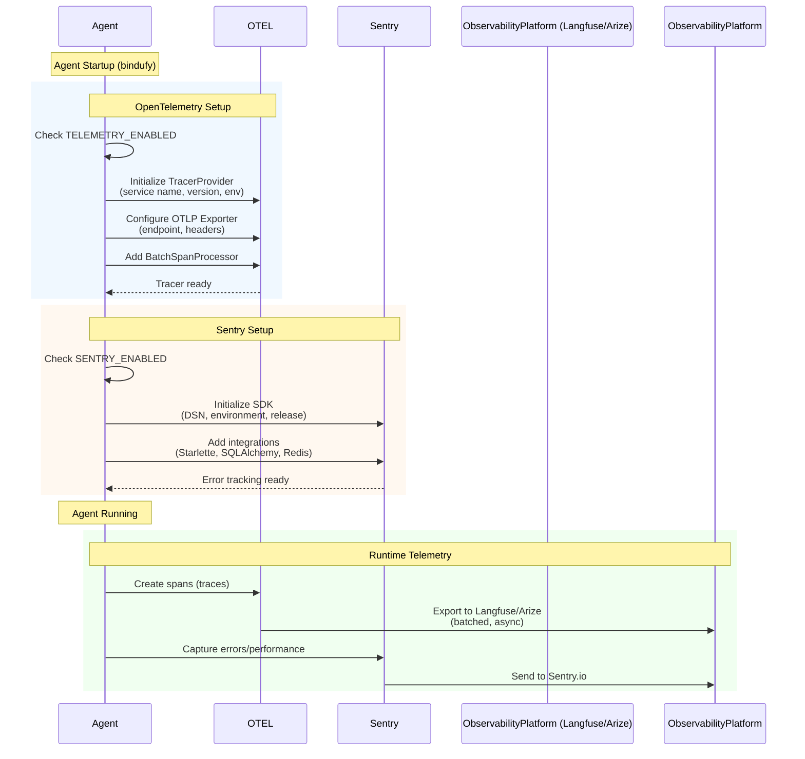

When agents become part of real systems, failures stop being isolated events. A slow dependency can distort latency. A missing trace can hide the real bottleneck. An uncaught error can surface long after the original cause has moved on.

Without observability, debugging turns into archaeology. You piece together what happened from symptoms, logs, and guesses. That is manageable in a toy system. It becomes expensive in production.

## Why Observability Matters

An agent should not just do work. It should leave a clear trail of how that work moved through the system and what broke when it failed.

| Minimal runtime visibility | Bindu observability |
| --- | --- |
| Hard to trace execution across components | Spans show how work moves through the system |
| Errors appear without enough context | Sentry captures failures with environment and release data |
| Difficult to compare environments | Service name, version, and deployment labels stay explicit |
| Debugging depends on manual reconstruction | Telemetry platforms make traces and failures searchable |
| Problems are easier to notice than explain | Observability helps teams understand cause, not just effect |

That is the shift: Bindu integrates OpenTelemetry and Sentry so performance, flow, and failure can be observed directly instead of inferred after the fact.

<Note>
If an agent handles important work, it should not fail silently or perform opaquely. Teams need a way to see the path of execution, not just the final outcome.
</Note>

## How Bindu Observability Works

Bindu integrates with **OpenTelemetry (OTEL)** and **Sentry** to provide comprehensive observability and error tracking for your agents. Monitor performance, trace execution flows, and debug issues using industry-standard platforms.

### The Observability Model

Bindu splits observability into two complementary channels:

```text
OpenTelemetry -> traces and execution flow
Sentry -> errors, releases, and performance incidents
```

Each layer answers a different question:

- **OpenTelemetry** shows how work moved
- **Sentry** shows where things failed and under what release or environment

<CardGroup cols={3}>
  <Card title="Traceable" icon="route">
    OpenTelemetry creates spans so developers can follow execution across the runtime.
  </Card>
  <Card title="Actionable" icon="bug">
    Sentry captures failures with context that helps teams respond faster.
  </Card>
  <Card title="Portable" icon="globe">
    OTLP-compatible telemetry can be sent to platforms like Langfuse or Arize without changing the agent model.
  </Card>
</CardGroup>

### The Lifecycle: Instrument, Export, Diagnose

Let's break the observability flow down before we look at configuration.



What this means is simple: observability begins at startup, stays close to runtime, and keeps a durable record of how work flowed and where it failed.

<Steps>
  <Step title="Instrument">
    On startup, Bindu checks whether telemetry and Sentry are enabled. If they are, it initializes the tracer provider, OTLP exporter, span processor, and Sentry SDK with the right environment and release metadata.

    This matters because good observability starts before the first request, not after the first incident.
  </Step>

  <Step title="Export">
    Once the agent is running, spans are created and exported asynchronously to an OTEL-compatible backend, while Sentry captures exceptions and performance information through its own pipeline.

    The effect is that one system explains flow and the other explains failure.
  </Step>

  <Step title="Diagnose">
    When something goes wrong, teams can inspect traces for path-level visibility and use Sentry for release-aware error context, stack traces, and performance events.

    Together, they shorten the distance between "something broke" and "we know why."
  </Step>
</Steps>

## OpenTelemetry Setup

### Supported Platforms

- **[Arize](https://arize.com/)** - AI observability platform for monitoring and debugging ML models
- **[Langfuse](https://langfuse.com/)** - Open-source LLM engineering platform with tracing and analytics
- **Any OTEL-compatible platform** - Supports standard OTLP protocol

### Configuration

Enable OpenTelemetry tracing via environment variables (see `.env.example`):

```bash
# Enable telemetry
TELEMETRY_ENABLED=true

# OTEL endpoint (platform-specific)
OLTP_ENDPOINT=https://cloud.langfuse.com/api/public/otel/v1/traces

# Service name for your agent
OLTP_SERVICE_NAME=research-agent

# Authentication headers (platform-specific)
OLTP_HEADERS={"Authorization":"Basic <base64-encoded-credentials>"}

# Optional: Enable verbose logging
OLTP_VERBOSE_LOGGING=true

# Optional: Additional configuration
OLTP_SERVICE_VERSION=1.0.0
OLTP_DEPLOYMENT_ENVIRONMENT=production
OLTP_BATCH_MAX_QUEUE_SIZE=2048
OLTP_BATCH_SCHEDULE_DELAY_MILLIS=5000
```

### Platform-Specific Setup

#### Langfuse

1. **Create Account**: Sign up at [cloud.langfuse.com](https://cloud.langfuse.com)

2. **Generate API Keys**:
   - Navigate to Settings → API Keys
   - Create new key pair (public and secret)

3. **Encode Credentials**:

   ```bash
   # Base64 encode "public-key:secret-key"
   echo -n "pk-xxx:sk-xxx" | base64
   ```

4. **Configure Environment**:

   ```bash
   TELEMETRY_ENABLED=true
   OLTP_ENDPOINT=https://cloud.langfuse.com/api/public/otel/v1/traces
   OLTP_SERVICE_NAME=your-agent-name
   OLTP_HEADERS={"Authorization":"Basic <base64-encoded-credentials>"}
   OLTP_VERBOSE_LOGGING=true
   ```

#### Arize

1. **Create Account**: Sign up at [arize.com](https://arize.com)

2. **Get Credentials**:
   - Navigate to Settings → API Keys
   - Copy Space ID and API Key

3. **Configure Environment**:

   ```bash
   TELEMETRY_ENABLED=true
   OLTP_ENDPOINT=https://otlp.arize.com/v1
   OLTP_SERVICE_NAME=your-agent-name
   OLTP_HEADERS={"space_id":"<your-space-id>","api_key":"<your-api-key>"}
   OLTP_VERBOSE_LOGGING=true
   ```

## Sentry Error Tracking

### Configuration

Enable Sentry via environment variables (see `.env.example`):

```bash
# Enable Sentry
SENTRY_ENABLED=true

# Sentry DSN (from your Sentry project)
SENTRY_DSN=https://<key>@<org-id>.ingest.sentry.io/<project-id>

# Optional: Environment name
SENTRY_ENVIRONMENT=production

# Optional: Release version
SENTRY_RELEASE=1.0.0

# Optional: Performance monitoring
SENTRY_TRACES_SAMPLE_RATE=1.0
SENTRY_PROFILES_SAMPLE_RATE=1.0
SENTRY_ENABLE_TRACING=true

# Optional: Privacy settings
SENTRY_SEND_DEFAULT_PII=false
SENTRY_DEBUG=false
```

### Setting Up Sentry

1. **Create Account**: Sign up at [sentry.io](https://sentry.io)

2. **Create Project**:
   - Select Python as platform
   - Copy the DSN from project settings

3. **Configure Environment**:

   ```bash
   SENTRY_ENABLED=true
   SENTRY_DSN=https://xxx@xxx.ingest.sentry.io/xxx
   SENTRY_ENVIRONMENT=production
   SENTRY_RELEASE=1.0.0
   ```

4. **Restart Agent**: Sentry initializes on startup

## Agent Configuration

No code changes are needed. Observability is configured via environment variables:

```python
config = {
    "author": "your.email@example.com",
    "name": "research_agent",
    "description": "A research assistant agent",
    "deployment": {"url": "http://localhost:3773", "expose": True},
    "skills": ["skills/question-answering"],
}

bindufy(config, handler)
```

That separation is deliberate. The agent defines behavior. The environment defines how deeply that behavior should be observed.

## Best Practices

### Sampling

For high-traffic agents, use sampling to reduce costs:

```bash
# Sample 10% of traces
SENTRY_TRACES_SAMPLE_RATE=0.1

# Sample 10% of profiles
SENTRY_PROFILES_SAMPLE_RATE=0.1
```

### Environment Separation

Use different environments for development and production:

```bash
# Development
SENTRY_ENVIRONMENT=development
OLTP_SERVICE_NAME=agent-dev

# Production
SENTRY_ENVIRONMENT=production
OLTP_SERVICE_NAME=agent-prod
```

### Custom Sentry Context

```python
import sentry_sdk

sentry_sdk.set_context("business", {
    "plan": "premium",
    "credits": 100
})

sentry_sdk.set_tag("feature", "pdf-processing")
```

## The Value Of Observable Systems

Observability only matters if it helps teams move from confusion to explanation.

This model gives you:

- **execution transparency** - traces reveal how requests move through the system
- **failure context** - Sentry attaches environment, release, and runtime detail to errors
- **faster debugging** - teams can inspect cause and path instead of relying on symptoms

This is the point of the whole model: as agents become more capable and more connected, their internal behavior should become easier to illuminate, not harder.

## Related

- [OpenTelemetry Python](https://opentelemetry.io/docs/instrumentation/python/)
- [Langfuse Documentation](https://langfuse.com/docs)
- [Arize Documentation](https://docs.arize.com/)
- [Sentry Python SDK](https://docs.sentry.io/platforms/python/)

---

<span className="brand-quote">
  

  <span className="brand-quote-text">
    Bindu brings clarity to your agents{" "}
    <span className="brand-quote-highlight">
      each one visible, traceable, and growing in trust&nbsp;
    </span>
    across the Internet of Agents.
  </span>
</span>
