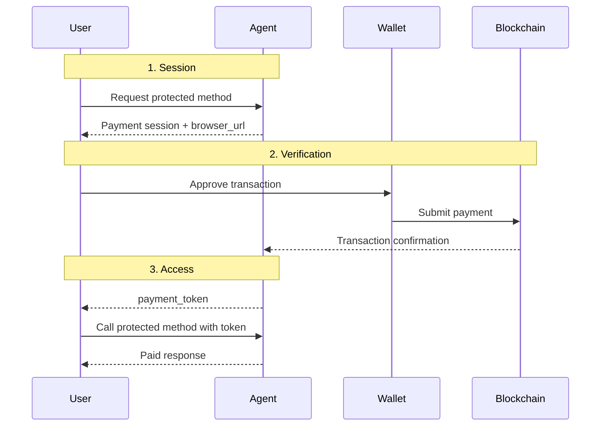

Free access works when every interaction is low-stakes. It breaks down when an agent delivers premium output, consumes paid infrastructure, or needs to enforce economic boundaries before work begins.

## Why Payments Matter

In an open Agent-to-Agent network, payment cannot depend on manual invoicing, custom dashboards, or a centralized billing gate. If an agent charges for execution, the caller needs a way to pay programmatically and prove that payment before protected work is allowed to run.

| Traditional Payment Rails | Bindu X402 Payments |
| --- | --- |
| Built for human checkout flows | Built for agent-to-agent and API-native flows |
| Verification often depends on a provider webhook | Verification is tied to on-chain payment proof |
| Hard to compose inside autonomous workflows | Designed to slot into agent execution paths |
| Usually centered on accounts and dashboards | Centered on requests, sessions, and payment tokens |
| Weak fit for crypto-native machine payments | Native fit for verifiable on-chain settlement |

That is the shift: Bindu gives agents a programmatic payment layer that can create sessions, verify on-chain payment, and issue short-lived access tokens for protected methods.

<Note>
If an agent offers premium actions, the calling system should not have to rely on a human approval step or a private billing back office. It should be able to pay, prove payment, and continue automatically.
</Note>

## How Bindu Payments Work

Bindu supports the **X402 payment protocol**, allowing you to require payment before executing specific agent methods. After a successful payment, Bindu issues a short-lived payment token that is used to access paid functionality.

### The Payment Model

Bindu uses a straightforward payment lifecycle:

```text
payment session -> wallet payment -> on-chain verification -> payment token
```

Example flow:

```text
user request -> paid method -> session created -> payment completed -> token issued
```

The model is easy for developers to reason about and strict enough for production controls:

- A **payment session** defines what must be paid
- A **wallet transaction** settles the payment on-chain
- A **verification step** confirms the transaction details
- A **payment token** proves access for the protected method

<CardGroup cols={3}>
  <Card title="Programmatic" icon="robot">
    Payments can be initiated and completed as part of automated agent workflows.
  </Card>
  <Card title="Verifiable" icon="shield-check">
    Bindu checks blockchain data before issuing access to protected methods.
  </Card>
  <Card title="Scoped" icon="key">
    Payment tokens are short-lived, task-specific, and bound to the paid access path.
  </Card>
</CardGroup>

### The Lifecycle: Session, Verification, Access

Under the hood, every paid Bindu interaction moves through three practical stages.



<Steps>
  <Step title="Session">
    Bindu creates a payment session whenever a caller attempts to access a protected method. The session captures the amount, token, network, and recipient wallet.

    ```python
    config = {
        "author": "your.email@example.com",
        "name": "paid_agent",
        "description": "An agent that requires payment",
        "deployment": {"url": "http://localhost:3773", "expose": True},
        "execution_cost": {
            "amount": "$0.0001",
            "token": "USDC",
            "network": "base-sepolia",
            "pay_to_address": "0xYourWalletAddressHere",
            "protected_methods": ["message/send"]
        }
    }
    ```

    Think of it like this: the config defines the economic gate, and Bindu turns that policy into a concrete payment session at runtime.
  </Step>

  <Step title="Verification">
    The user completes payment in their wallet. Bindu then validates the transaction on-chain by checking the sender, recipient, amount, and network before it grants access.

    <CodeGroup>
      ```bash Request
      curl http://localhost:3773/api/payment-status/<session_id>
      ```

      ```json Response
      {
        "status": "completed",
        "payment_token": "<token>"
      }
      ```
    </CodeGroup>

    Only verified transactions result in token issuance.
  </Step>

  <Step title="Access">
    Once payment is verified, the caller uses the returned payment token to access the protected method.

    <CodeGroup>
      ```bash Protected Request
      curl http://localhost:3773/ \
        -H "X-Payment-Token: <token>" \
        -d '{ "method": "message/send" }'
      ```

      ```json Protected Response
      {
        "result": "Paid method executed successfully"
      }
      ```
    </CodeGroup>

    The token is short-lived and scoped to the paid interaction rather than acting like a reusable long-term credential.
  </Step>
</Steps>

---

## Payment Configuration

Bindu lets you define either a single payment path or multiple acceptable payment options depending on how flexible you want the checkout experience to be.

### Single Option

```python
config = {
    "author": "your.email@example.com",
    "name": "paid_agent",
    "description": "An agent that requires payment",
    "deployment": {"url": "http://localhost:3773", "expose": True},
    "execution_cost": {
        "amount": "$0.0001",
        "token": "USDC",
        "network": "base-sepolia",
        "pay_to_address": "0xYourWalletAddressHere",
        "protected_methods": ["message/send"]
    }
}
```

### Multiple Options

You can provide multiple payment options. Any one of them satisfies access.

```python
config = {
    "execution_cost": [
        {
            "amount": "0.1",
            "token": "USDC",
            "network": "base",
            "pay_to_address": "0xYourWalletAddressHere",
        },
        {
            "amount": "0.0001",
            "token": "ETH",
            "network": "ethereum",
            "pay_to_address": "0xYourWalletAddressHere",
        }
    ]
}
```

Each model serves a different need:

- Use a **single option** when the payment path should be predictable and simple
- Use **multiple options** when callers may pay with different assets or networks
- Protect only the methods that actually require monetization through `protected_methods`

<Note>
If you are testing for the first time, start on `base-sepolia`, fund a wallet with test assets, and set `pay_to_address` explicitly before exposing paid methods.
</Note>

### Standards

<CardGroup cols={3}>
  <Card title="X402 Protocol" icon="credit-card" href="https://github.com/coinbase/x402">
    The payment protocol Bindu uses to structure monetized API and agent flows.
  </Card>
  <Card title="Base Network Info" icon="globe" href="https://docs.base.org/network-information">
    Network details for configuring supported chains such as Base and Base Sepolia.
  </Card>
  <Card title="JWT Access Tokens" icon="key-round" href="https://jwt.io/introduction">
    Short-lived payment tokens give callers scoped proof of successful payment.
  </Card>
</CardGroup>

## The Value of Verifiable Payments

Payments only matter if they hold up when a request is challenged, replayed, or audited.

This model gives you:

- **Access control** - Protected methods only run after verified payment
- **Integrity** - The payment is checked against blockchain data before access is granted
- **Composability** - Agents can include payment directly inside autonomous workflows

This is the point of the whole model: monetization becomes part of protocol behavior instead of a disconnected billing system.

## Real-World Use Cases

<AccordionGroup>
  <Accordion title="Premium research or inference endpoints">
    If an agent performs expensive inference, premium research, or API-backed work, payment can be required before execution so infrastructure cost is enforced at the request boundary.

    ```python
    def require_payment_before_inference(session_status):
        if session_status["status"] != "completed":
            raise PermissionError("Payment required before premium inference.")
        return "Inference can proceed"
    ```
  </Accordion>

  <Accordion title="Agent-to-agent paid task execution">
    One agent can pay another for specialized work, then pass the payment token with the protected call to complete the transaction programmatically.

    ```python
    async def call_paid_agent(payment_token, payload):
        headers = {"X-Payment-Token": payment_token}
        return await httpx.post("http://localhost:3773/", headers=headers, json=payload)
    ```
  </Accordion>

  <Accordion title="Micropayments for metered APIs">
    Small, per-task payments work well for lightweight operations such as summarization, classification, scraping, or data transformation where subscriptions would add unnecessary friction.

    ```python
    config = {
        "execution_cost": {
            "amount": "$0.0001",
            "token": "USDC",
            "network": "base-sepolia",
            "pay_to_address": "0xYourWalletAddressHere",
            "protected_methods": ["message/send"]
        }
    }
    ```
  </Accordion>

  <Accordion title="Crypto-native developer products">
    If your product already lives in an on-chain environment, X402 lets your payment logic stay aligned with the rest of the system instead of bridging through a separate billing stack.

    ```python
    def verify_paid_access(session):
        return session.get("status") == "completed" and "payment_token" in session
    ```
  </Accordion>
</AccordionGroup>

## Security Best Practices

<CardGroup cols={2}>
  <Card title="Keep Prices Explicit" icon="coins">
    Clearly define amount, token, network, and protected methods so callers know exactly what they are paying for.
  </Card>
  <Card title="Scope Tokens Tightly" icon="lock">
    Use short-lived, task-specific payment tokens and avoid treating them like reusable API credentials.
  </Card>
</CardGroup>

---

## Related

* https://github.com/coinbase/x402
* https://docs.base.org/network-information
* /bindu/learn/did/overview

---

<span className="brand-quote">
  

  <span className="brand-quote-text">
    Bindu allows agents to bloom independently{" "}
    <span className="brand-quote-highlight">
      turning trust into verifiable value
    </span>
    , and bringing light to the Internet of Agents.
  </span>
</span>
