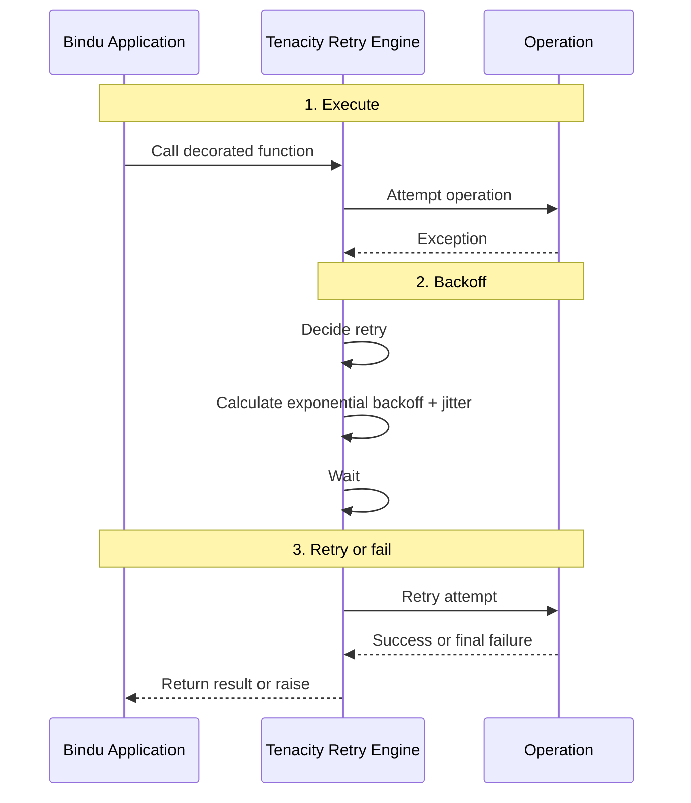

Things fail in production for ordinary reasons. A database connection drops. Redis goes away for a moment. An API times out. Most of those failures are temporary, but if the system treats every one of them as final, tasks fail for no good reason.

## Why Retry Matters

Bindu includes a built-in Tenacity-based retry mechanism to handle transient failures across workers, storage, schedulers, and API calls. The point is simple: let the system recover from short-lived failures without turning every hiccup into a broken task.

| Without retry | With Bindu retry |
| --- | --- |
| Temporary failures surface as immediate task failures | Transient failures can recover automatically |
| Recovering services get hit again at the same time by every client | Exponential backoff with jitter spreads retry pressure out |
| Worker, storage, and scheduler failures each need custom handling | The same retry approach covers all critical operation types |
| Troubleshooting depends on guesswork | Retry attempts and outcomes are logged |
| Tuning behavior requires code changes | Environment variables and overrides make tuning easier |

That is the shift: instead of assuming every failure is permanent, Bindu gives critical operations a controlled way to try again when the failure looks temporary.

<Note>
Retry is for transient failures. It helps when something is briefly unavailable. It is not a substitute for fixing permanent errors, non-idempotent behavior, or bad input.
</Note>

## How Bindu Retry Works

The retry mechanism is built on Tenacity. It wraps critical operations with automatic retry logic, exponential backoff, jitter, and logging.

### The Runtime Model

Retry logic is applied across the main operation types:

- worker operations
- storage operations
- scheduler operations
- API calls
- application startup

<CardGroup cols={3}>
  <Card title="Automatic Recovery" icon="shield-check">
    Network timeouts, database issues, Redis failures, and temporary service outages can be retried without manual intervention.
  </Card>
  <Card title="Backoff With Jitter" icon="link">
    Wait times grow between attempts and include jitter to avoid retry storms.
  </Card>
  <Card title="Configurable" icon="globe">
    Retry behavior can be tuned globally through environment variables or overridden per operation.
  </Card>
</CardGroup>

### The Lifecycle: Fail, Wait, Try Again

Under the hood, every retried operation follows the same basic path.



<Steps>
  <Step title="Execution">
    A decorated function is called in the usual way. This can be a worker method, a storage operation, a scheduler command, or an API call.

    The operation categories in Bindu are:

    - `@retry_worker_operation()`
    - `@retry_storage_operation()`
    - `@retry_scheduler_operation()`
    - `@retry_api_call()`
  </Step>

  <Step title="Failure Handling">
    If the operation raises an exception, the retry decorator catches it and asks Tenacity whether the failure should be retried.

    By default, retries happen on:

    - `ConnectionError`
    - `TimeoutError`
    - `asyncio.TimeoutError`
    - generic `Exception`
  </Step>

  <Step title="Backoff And Retry">
    If the exception is retryable, Tenacity applies exponential backoff with jitter, waits, and tries the operation again.

    Wait time grows like this:

    `min_wait * (2 ^ attempt) + random_jitter`

    The wait is capped at `max_wait`. The operation either succeeds on a later attempt or exhausts the retry budget and fails.
  </Step>
</Steps>

---

## Configuration

### Environment Variables

Configure retry behavior through `.env`:

```bash
# Worker Retry Settings
RETRY__WORKER_MAX_ATTEMPTS=3
RETRY__WORKER_MIN_WAIT=1.0
RETRY__WORKER_MAX_WAIT=10.0

# Storage Retry Settings
RETRY__STORAGE_MAX_ATTEMPTS=5
RETRY__STORAGE_MIN_WAIT=0.5
RETRY__STORAGE_MAX_WAIT=5.0

# Scheduler Retry Settings
RETRY__SCHEDULER_MAX_ATTEMPTS=3
RETRY__SCHEDULER_MIN_WAIT=1.0
RETRY__SCHEDULER_MAX_WAIT=8.0

# API Retry Settings
RETRY__API_MAX_ATTEMPTS=4
RETRY__API_MIN_WAIT=1.0
RETRY__API_MAX_WAIT=15.0
```

### Default Settings

If these are not configured, Bindu uses:

| Operation Type | Max Attempts | Min Wait | Max Wait |
| --- | --- | --- | --- |
| Worker | 3 | 1.0s | 10.0s |
| Storage | 5 | 0.5s | 5.0s |
| Scheduler | 3 | 1.0s | 8.0s |
| API | 4 | 1.0s | 15.0s |

Configuration parameters:

- `max_attempts` - maximum number of retry attempts before giving up
- `min_wait` - minimum wait time between retries in seconds
- `max_wait` - maximum wait time between retries in seconds

<Note>
The defaults are not all the same for a reason. Storage gets more attempts than worker execution because short-lived database failures are common and often worth waiting out.
</Note>

### Retry Decorators

<CodeGroup>
  ```python Worker Operations
  from bindu.utils.retry import retry_worker_operation

  @retry_worker_operation()
  async def run_task(self, params: TaskSendParams) -> None:
      # Task execution logic
      # Retries: 3 attempts, 1-10s wait
      pass

  @retry_worker_operation(max_attempts=2)
  async def cancel_task(self, task_id: UUID) -> None:
      # Task cancellation logic
      # Custom: 2 attempts
      pass
  ```

  ```python Storage Operations
  from bindu.utils.retry import retry_storage_operation

  @retry_storage_operation()
  async def load_task(self, task_id: UUID) -> Task:
      # Database read operation
      # Retries: 5 attempts, 0.5-5s wait
      pass

  @retry_storage_operation(max_attempts=10, min_wait=2.0)
  async def update_task(self, task_id: UUID, state: str) -> Task:
      # Database write with custom retry
      # Custom: 10 attempts, 2-5s wait
      pass
  ```
</CodeGroup>

```python
from bindu.utils.retry import retry_scheduler_operation

@retry_scheduler_operation()
async def run_task(self, task: Task) -> None:
    # Queue task for execution
    # Retries: 3 attempts, 1-8s wait
    pass

@retry_scheduler_operation(max_attempts=5)
async def pause_task(self, task_id: UUID) -> None:
    # Pause task with custom retry
    # Custom: 5 attempts
    pass
```

```python
from bindu.utils.retry import retry_api_call

@retry_api_call()
async def call_external_service(self, data: dict) -> dict:
    # External API call
    # Retries: 4 attempts, 1-15s wait
    pass

@retry_api_call(max_attempts=6, max_wait=30.0)
async def call_llm_api(self, prompt: str) -> str:
    # LLM API with longer retry
    # Custom: 6 attempts, 1-30s wait
    pass
```

Defaults by type:

- worker operations: 3 attempts, 1-10s exponential backoff
- storage operations: 5 attempts, 0.5-5s exponential backoff
- scheduler operations: 3 attempts, 1-8s exponential backoff
- API operations: 4 attempts, 1-15s exponential backoff

## Ad-Hoc Retry

For one-off retry logic without decorators:

```python
from bindu.utils.retry import execute_with_retry

# Retry an async function
result = await execute_with_retry(
    some_async_function,
    arg1, arg2,
    kwarg1="value",
    max_attempts=5,
    min_wait=1.0,
    max_wait=10.0
)

# Retry a sync function
result = await execute_with_retry(
    some_sync_function,
    arg1, arg2,
    max_attempts=3,
    min_wait=0.5,
    max_wait=5.0
)
```

Use this for dynamic retry logic, testing, and special cases.

## Applied Retry Logic

Retry is already wired into several parts of the codebase.

### Worker Operations

**File**: `bindu/server/workers/manifest_worker.py`

```python
@retry_worker_operation()
async def run_task(self, params: TaskSendParams) -> None:
    """Execute task with automatic retry on transient failures."""
    # Task execution logic
    pass

@retry_worker_operation(max_attempts=2)
async def cancel_task(self, task_id: UUID) -> None:
    """Cancel task with limited retry attempts."""
    # Cancellation logic
    pass
```

### PostgreSQL Storage

**File**: `bindu/server/storage/postgres_storage.py`

All database operations use `execute_with_retry()` via `_retry_on_connection_error()`:

```python
async def load_task(self, task_id: UUID) -> Task:
    """Load task with automatic retry on connection errors."""
    return await self._retry_on_connection_error(
        self._load_task_impl, task_id
    )
```

### Redis Scheduler

**File**: `bindu/server/scheduler/redis_scheduler.py`

```python
@retry_scheduler_operation()
async def run_task(self, task: Task) -> None:
    """Queue task with retry on Redis connection issues."""
    # Redis LPUSH operation
    pass

@retry_scheduler_operation()
async def pause_task(self, task_id: UUID) -> None:
    """Pause task with retry on transient failures."""
    # Redis operation
    pass
```

### In-Memory Storage

**File**: `bindu/server/storage/memory_storage.py`

```python
@retry_storage_operation(max_attempts=3, min_wait=0.1, max_wait=1.0)
async def load_task(self, task_id: UUID) -> Task:
    """Load task with short retry window (in-memory)."""
    # Memory operation
    pass
```

### Application Initialization

**File**: `bindu/server/applications.py`

```python
# Retry storage initialization
storage = await execute_with_retry(
    create_storage,
    storage_config,
    max_attempts=app_settings.retry.storage_max_attempts,
    min_wait=app_settings.retry.storage_min_wait,
    max_wait=app_settings.retry.storage_max_wait
)

# Retry scheduler initialization
scheduler = await execute_with_retry(
    create_scheduler,
    scheduler_config,
    max_attempts=app_settings.retry.scheduler_max_attempts,
    min_wait=app_settings.retry.scheduler_min_wait,
    max_wait=app_settings.retry.scheduler_max_wait
)
```

## Best Practices

<AccordionGroup>
  <Accordion title="Use appropriate retry settings">
    Match retry settings to the operation.

    ```bash
    # Fast in-memory operations
    RETRY__STORAGE_MAX_ATTEMPTS=3
    RETRY__STORAGE_MIN_WAIT=0.1
    RETRY__STORAGE_MAX_WAIT=1.0

    # Network-dependent operations
    RETRY__API_MAX_ATTEMPTS=5
    RETRY__API_MIN_WAIT=2.0
    RETRY__API_MAX_WAIT=30.0
    ```
  </Accordion>

  <Accordion title="Override defaults when needed">
    Customize retry behavior for specific operations.

    ```python
    # Critical operation - more retries
    @retry_storage_operation(max_attempts=10)
    async def critical_update(self, data: dict) -> None:
        pass

    # Quick operation - fewer retries
    @retry_worker_operation(max_attempts=2, max_wait=5.0)
    async def quick_task(self) -> None:
        pass
    ```
  </Accordion>

  <Accordion title="Monitor retry attempts">
    Watch logs for retry patterns.

    ```text
    [WARNING] Retry attempt 1/3 for run_task failed: ConnectionError
    [WARNING] Retry attempt 2/3 for run_task failed: ConnectionError
    [INFO] Retry succeeded on attempt 3/3 for run_task
    ```
  </Accordion>

  <Accordion title="Ensure idempotency">
    Make operations safe to retry.

    ```python
    @retry_storage_operation()
    async def update_task_status(self, task_id: UUID, status: str) -> None:
        # Idempotent: Setting status to same value is safe
        await self.db.execute(
            "UPDATE tasks SET status = :status WHERE task_id = :task_id",
            {"status": status, "task_id": task_id}
        )
    ```
  </Accordion>

  <Accordion title="Handle non-retryable errors">
    Distinguish between transient and permanent failures.

    ```python
    from tenacity import retry_if_exception_type

    @retry_api_call(
        retry=retry_if_exception_type((ConnectionError, TimeoutError))
    )
    async def call_api(self, data: dict) -> dict:
        # Only retry on connection/timeout, not on validation errors
        response = await api_client.post("/endpoint", json=data)
        if response.status_code == 400:
            raise ValueError("Invalid request")  # Don't retry
        return response.json()
    ```
  </Accordion>

  <Accordion title="Set reasonable timeouts">
    Combine retries with per-attempt timeouts.

    ```python
    import asyncio

    @retry_api_call(max_attempts=3)
    async def call_with_timeout(self, data: dict) -> dict:
        try:
            return await asyncio.wait_for(
                api_client.post("/endpoint", json=data),
                timeout=10.0  # 10 second timeout per attempt
            )
        except asyncio.TimeoutError:
            raise  # Will be retried
    ```
  </Accordion>

  <Accordion title="Log retry context">
    Add enough context to make retry logs useful.

    ```python
    from bindu.utils.logging import get_logger

    logger = get_logger(__name__)

    @retry_worker_operation()
    async def process_task(self, task_id: UUID) -> None:
        logger.info("Processing task", task_id=str(task_id))
        try:
            # Task processing
            pass
        except Exception as e:
            logger.error("Task processing failed", task_id=str(task_id), error=str(e))
            raise  # Will be retried
    ```
  </Accordion>
</AccordionGroup>

## Monitoring And Observability

Retry attempts are logged automatically:

```text
[WARNING] Retry attempt 1/5 for load_task failed: ConnectionError: Database connection lost
[INFO] Waiting 0.8s before retry attempt 2/5
[WARNING] Retry attempt 2/5 for load_task failed: ConnectionError: Database connection lost
[INFO] Waiting 1.9s before retry attempt 3/5
[INFO] Retry succeeded on attempt 3/5 for load_task
```

Key metrics to watch:

- retry rate
- retry success rate
- average retry attempts
- retry duration
- failure types

Retry failures are automatically captured by Sentry:

```python
# Failed retries appear in Sentry with full context
# Including: operation name, attempt count, exception details
```

## Troubleshooting

### Too Many Retries

Symptom: operations take too long because of excessive retry loops

Solutions:

1. Reduce `max_attempts`
2. Decrease `max_wait`
3. Fix the underlying issue causing failures
4. Add a circuit breaker pattern

```bash
# Reduce retry attempts
RETRY__WORKER_MAX_ATTEMPTS=2
RETRY__WORKER_MAX_WAIT=5.0
```

### Retries Not Working

Symptom: operations fail without retry attempts

Solutions:

1. Check that the decorator is present
2. Verify the exception is retryable
3. Check retry settings are loaded
4. Review logs for retry messages

```python
# Ensure decorator is present
@retry_worker_operation()  # <- Must be here
async def my_operation(self) -> None:
    pass
```

### Thundering Herd

Symptom: many instances retry at once and overwhelm the recovering service

Solutions:

1. Jitter is automatic, but increase `max_wait`
2. Stagger instance startup times
3. Add a circuit breaker
4. Use rate limiting

```bash
# Increase max wait for more jitter spread
RETRY__API_MAX_WAIT=30.0
```

### Non-Idempotent Operations

Symptom: retries create duplicate work or data corruption

Solutions:

1. Make operations idempotent
2. Use idempotency keys
3. Check state before retry
4. Reduce retry attempts

```python
@retry_storage_operation(max_attempts=2)  # Limit retries
async def non_idempotent_operation(self, data: dict) -> None:
    # Check if already processed
    if await self.is_processed(data["id"]):
        return
    # Process only once
    await self.process(data)
```

## Testing

### Unit Tests

```python
import pytest
from bindu.utils.retry import retry_worker_operation

@pytest.mark.asyncio
async def test_retry_success_after_failure():
    """Test that operation succeeds after transient failure."""
    attempts = 0
    
    @retry_worker_operation(max_attempts=3, min_wait=0.1, max_wait=0.5)
    async def flaky_operation():
        nonlocal attempts
        attempts += 1
        if attempts < 3:
            raise ConnectionError("Transient failure")
        return "success"
    
    result = await flaky_operation()
    assert result == "success"
    assert attempts == 3
```

### Integration Tests

```bash
# Run retry tests
uv run pytest tests/unit/test_retry.py -v

# Run all tests
uv run pytest tests/ -v
```

## Performance Considerations

Each retry adds latency:

- **1 retry** - `~1-2s` additional latency
- **3 retries** - `~5-10s` additional latency
- **5 retries** - `~15-30s` additional latency

Memory overhead stays small:

- retry state: `~100 bytes` per operation
- logging: `~500 bytes` per retry attempt
- total: negligible for most applications

CPU overhead is also small:

- backoff calculation: `~0.01ms`
- jitter generation: `~0.001ms`
- logging: `~0.1ms`

## Future Enhancements

<CardGroup cols={2}>
  <Card title="Circuit Breaker" icon="shield-check">
    Planned support for failure thresholds and recovery windows to stop retry storms when a service is clearly down.
  </Card>
  <Card title="Retry Metrics" icon="globe">
    Planned export of retry metrics such as attempts, success rate, and retry duration.
  </Card>
</CardGroup>

Additional planned features:

```python
# Planned feature
@retry_with_circuit_breaker(
    failure_threshold=5,
    recovery_timeout=60.0
)
async def call_service(self) -> dict:
    pass
```

```python
# Planned feature
- retry_attempts_total
- retry_success_rate
- retry_duration_seconds
```

```python
# Planned feature
@retry_with_adaptive_backoff()
async def smart_retry(self) -> None:
    pass
```

```python
# Planned feature
@retry_with_budget(max_total_time=30.0)
async def bounded_retry(self) -> None:
    pass
```

## Comparison With Alternatives

| Feature | Tenacity | Backoff | Retry | Custom |
| --- | --- | --- | --- | --- |
| Async support | ✅ Native | ⚠️ Limited | ❌ No | ⚠️ Manual |
| Exponential backoff | ✅ Built-in | ✅ Built-in | ✅ Built-in | ⚠️ Manual |
| Jitter | ✅ Built-in | ✅ Built-in | ❌ No | ⚠️ Manual |
| Decorators | ✅ Yes | ✅ Yes | ✅ Yes | ⚠️ Manual |
| Configurability | ✅ Extensive | ⚠️ Moderate | ⚠️ Basic | ✅ Full |
| Logging | ✅ Integrated | ⚠️ Basic | ❌ No | ⚠️ Manual |
| Best for | Production | Simple cases | Legacy code | Special needs |

## Related

* https://tenacity.readthedocs.io

---

<span className="brand-quote">
  

  <span className="brand-quote-text">
    Bindu treats transient failure as{" "}
    <span className="brand-quote-highlight">
      something to recover from, not just something to log
    </span>
    , so agents keep moving when dependencies stumble.
  </span>
</span>
