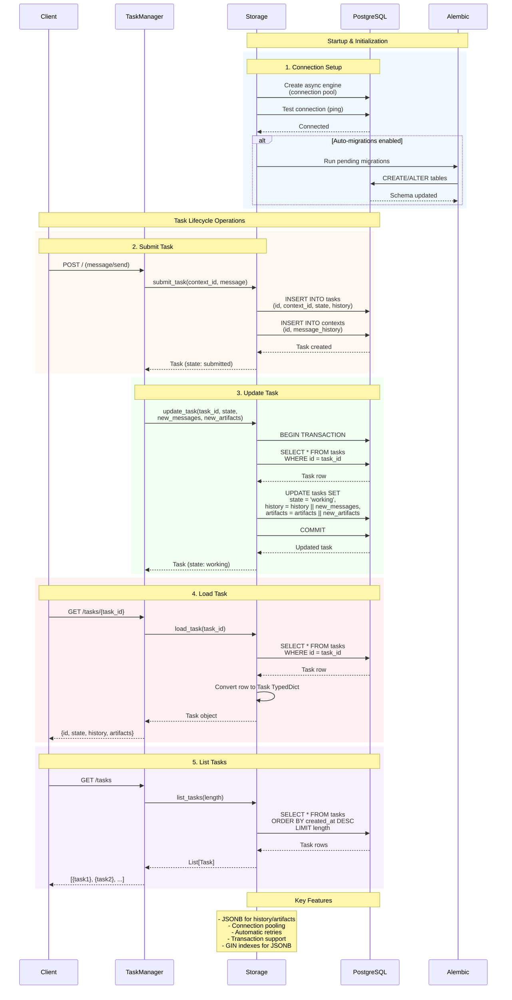

When agents start doing real work, memory is no longer just a nice feature it becomes important.
A task can take many steps, a conversation might continue later and if something fails in between, the system shouldn’t lose everything it already learned.

That’s where storage becomes important. Without it, an agent can only respond in the moment. It can’t remember things over time, recover properly after errors, or keep track of what happened.
And as more users and real workflows come in, this becomes even more important to keep everything reliable and consistent.

## Why Persistent Storage Matters

For early development, ephemeral memory is enough. For production, it is not.

| In-memory storage | PostgreSQL storage |
| --- | --- |
| Fast for local development and tests | Durable for production workloads |
| State disappears when the process restarts | State survives restarts and redeploys |
| Best for short-lived experiments | Best for long-running tasks and real users |
| Minimal operational overhead | Supports migrations, transactions, and indexing |
| Harder to inspect after the fact | Easier to audit, debug, and recover |

Bindu uses PostgreSQL as its persistent storage backend for production deployments. The storage layer is built with SQLAlchemy's async engine and uses imperative mapping with protocol TypedDicts.

<Note>
Storage is optional. `InMemoryStorage` is used by default for development and testing, while PostgreSQL is the path you take when the agent needs durable memory.
</Note>

## The Task Of The Storage Layer

Bindu's storage layer has a simple responsibility with serious consequences: keep the agent's state intact while the rest of the system keeps moving.

In practice, that means the storage layer is responsible for:

- persisting task state over time
- preserving context and message history
- storing artifacts produced during execution
- supporting feedback and operational review
- doing all of this without forcing the agent to think about the database directly

This is subtle, but important. The agent should focus on doing the work. Storage should quietly hold the soil underneath it.

## What Actually Happens Behind The Scenes

Let's break the storage flow down first at a high level, then step by step.



What this means is simple: storage begins at startup, stays close to every task operation, and turns transient execution into durable system memory.

<Steps>
  <Step title="Situation: Startup and Initialization">
    Before an agent can remember anything, it needs a trustworthy connection to the database. That means creating an async engine, testing connectivity, and making sure the schema is ready before work starts.

    If auto-migrations are enabled, Bindu also runs pending Alembic migrations so the database structure can keep growing without manual intervention on every deploy.
  </Step>

  <Step title="Task: Accept and Persist Work">
    When a client submits a task, the storage layer writes the first durable record of that work. It stores the task itself, links it to a context, and captures the earliest history needed to reconstruct the flow later.
  </Step>

  <Step title="Action: Update, Load, and List State">
    As the task evolves, storage updates state inside a transaction, appends new history and artifacts, and returns strongly shaped Task objects back to the rest of the system.

    When a user asks for a task again, storage loads it from PostgreSQL, converts the row back into the protocol shape, and sends it up the stack. When a user wants an overview, storage lists the newest tasks in descending order of creation time.
  </Step>

  <Step title="Result: Durable Agent Memory">
    The result is continuity. Tasks survive process restarts. Context survives time. Artifacts remain inspectable. The agent grows without losing the trail behind it.
  </Step>
</Steps>

## Storage Structure

Under the surface, the design is intentionally small. The storage layer uses three main tables, each with a clear role.

### 1. `tasks_table`

This is where Bindu keeps the full execution trail of a task, including its evolving state and outputs.

- `task_id` (UUID, primary key)
- `context_id` (UUID, foreign key to contexts_table)
- `status` (enum: pending, running, completed, failed, input_required)
- `history` (JSONB array of execution steps)
- `artifacts` (JSONB object for task outputs)
- `created_at`, `updated_at` (timestamps)

Why this matters:

- the task row becomes the durable timeline of execution
- JSONB allows flexible task history and artifact storage
- timestamps make debugging and operations much easier later

### 2. `contexts_table`

This table keeps the surrounding conversation and metadata that give a task meaning over time.

- `context_id` (UUID, primary key)
- `messages` (JSONB array of conversation messages)
- `metadata` (JSONB object for custom data)
- `created_at`, `updated_at` (timestamps)

Why this matters:

- a task rarely stands alone; it usually lives inside a conversation
- context lets an agent return to the same thread with continuity
- metadata gives you room for system-specific state without redesigning the schema every time

### 3. `task_feedback_table`

This optional table stores the human signal that often matters most after execution: feedback.

- `feedback_id` (UUID, primary key)
- `task_id` (UUID, foreign key to tasks_table)
- `feedback` (text)
- `rating` (integer, 1-5)
- `metadata` (JSONB object)
- `created_at` (timestamp)

Why this matters:

- feedback connects outcomes to quality
- it gives teams a durable loop for evaluation
- it makes production systems easier to improve instead of merely operate

## Configuration

Storage should be easy to switch on when the time comes. Bindu keeps that surface intentionally small.

### Environment Variables

Configure PostgreSQL connection via environment variables (see `.env.example`):

```bash
# Storage Configuration
# Type: "postgres" for PostgreSQL or "memory" for in-memory storage
STORAGE_TYPE=postgres

# PostgreSQL connection string
DATABASE_URL=postgresql+asyncpg://<user>:<password>@<host>:<port>/<database>?ssl=require
```

The connection string format is:

```text
postgresql+asyncpg://<username>:<password>@<hostname>:<port>/<database>?ssl=require
```

Example:

```bash
DATABASE_URL=postgresql+asyncpg://bindu_user:<password>@localhost:5432/bindu_db?ssl=require
```

### Agent Configuration

No additional configuration is needed in your agent code. Storage is configured via environment variables, which keeps the agent definition clean:

```python
config = {
    "author": "your.email@example.com",
    "name": "research_agent",
    "description": "A research assistant agent",
    "deployment": {"url": "http://localhost:3773", "expose": True},
    "skills": ["skills/question-answering", "skills/pdf-processing"],
}

bindufy(config, handler)
```

That separation is deliberate. Your agent declares what it is. The environment decides how durable its memory should be.

## Setting Up PostgreSQL

The setup path depends on where you are in the journey. Local development is about getting signal quickly. Cloud deployment is about getting durability without running the database yourself.

### Local Development

#### Using Docker (Recommended)

If you want the fastest clean setup, Docker is the shortest path:

```bash
# Start PostgreSQL container
docker run -d \
  --name bindu-postgres \
  -e POSTGRES_USER=bindu_user \
  -e POSTGRES_PASSWORD=bindu_password \
  -e POSTGRES_DB=bindu_db \
  -p 5432:5432 \
  postgres:15-alpine

# Set environment variable
export DATABASE_URL="postgresql+asyncpg://bindu_user:<password>@localhost:5432/bindu_db"
```

#### Using Local PostgreSQL

If you already run PostgreSQL locally, the flow is straightforward:

1. Install PostgreSQL:

   ```bash
   # macOS
   brew install postgresql@15
   brew services start postgresql@15

   # Ubuntu/Debian
   sudo apt-get install postgresql-15
   sudo systemctl start postgresql
   ```

2. Create database and user:

   ```sql
   CREATE DATABASE bindu_db;
   CREATE USER bindu_user WITH ENCRYPTED PASSWORD '<your_password>';
   GRANT ALL PRIVILEGES ON DATABASE bindu_db TO bindu_user;
   ```

3. Set environment variable:

   ```bash
   export DATABASE_URL="postgresql+asyncpg://bindu_user:<password>@localhost:5432/bindu_db"
   ```

### Cloud Deployment

#### Neon (Serverless PostgreSQL)

If you want managed infrastructure, Neon is a clean fit:

1. Create account at [neon.tech](https://neon.tech)
2. Create a new project
3. Copy the connection string
4. Set environment variable:

   ```bash
   export DATABASE_URL="postgresql+asyncpg://<user>:<password>@ep-xxx.us-east-2.aws.neon.tech/bindu?sslmode=require"
   ```

The result is the same in both cases: once `DATABASE_URL` is in place, Bindu can treat durable storage as part of the agent's normal runtime rather than a special mode.

## Database Migrations

Schema is part of the story too. As the product grows, storage has to grow without losing what already exists.

Bindu uses Alembic for database migrations.

### Running Migrations

Migrations run automatically on startup by default. To disable:

```bash
# Disable automatic migrations
export STORAGE__RUN_MIGRATIONS_ON_STARTUP=false
```

### Manual Migration Commands

When you need more control, use the migration commands directly:

```bash
# Run all pending migrations
uv run alembic upgrade head

# Rollback one migration
uv run alembic downgrade -1

# View migration history
uv run alembic history

# Create new migration (for development)
uv run alembic revision --autogenerate -m "description"
```

### Migration Files

Located in `alembic/versions/`:

- `20251207_0001_initial_schema.py` - Initial database schema
- `20250614_0001_add_webhook_configs_table.py` - Webhook configurations
- Additional migrations as needed

### Manual Backup

Even with migrations in place, backups matter. They are the quiet proof that growth does not have to mean fragility.

```bash
# Backup database
pg_dump -h hostname -U username -d bindu_db > backup.sql

# Restore database
psql -h hostname -U username -d bindu_db < backup.sql
```

## What You Gain

Once PostgreSQL is in place, Bindu gains something deeper than persistence. It gains continuity.

- tasks can survive restarts and long-running execution
- contexts remain available across time and deployments
- artifacts stay inspectable for debugging and review
- feedback can become part of the operational loop
- migrations and backups make change safer instead of riskier

This design matters because agents do not just need intelligence. They need memory that can be trusted.

---

## Related

* https://www.postgresql.org/
* https://docs.sqlalchemy.org/
* https://alembic.sqlalchemy.org/

---

<span className="brand-quote">
  

  <span className="brand-quote-text">
    Bindu storage roots agents in{" "}
    <span className="brand-quote-highlight">
      reliable memory, making them verifiable&nbsp;
    </span>
    and bringing trust to the Internet of Agents.
  </span>
</span>