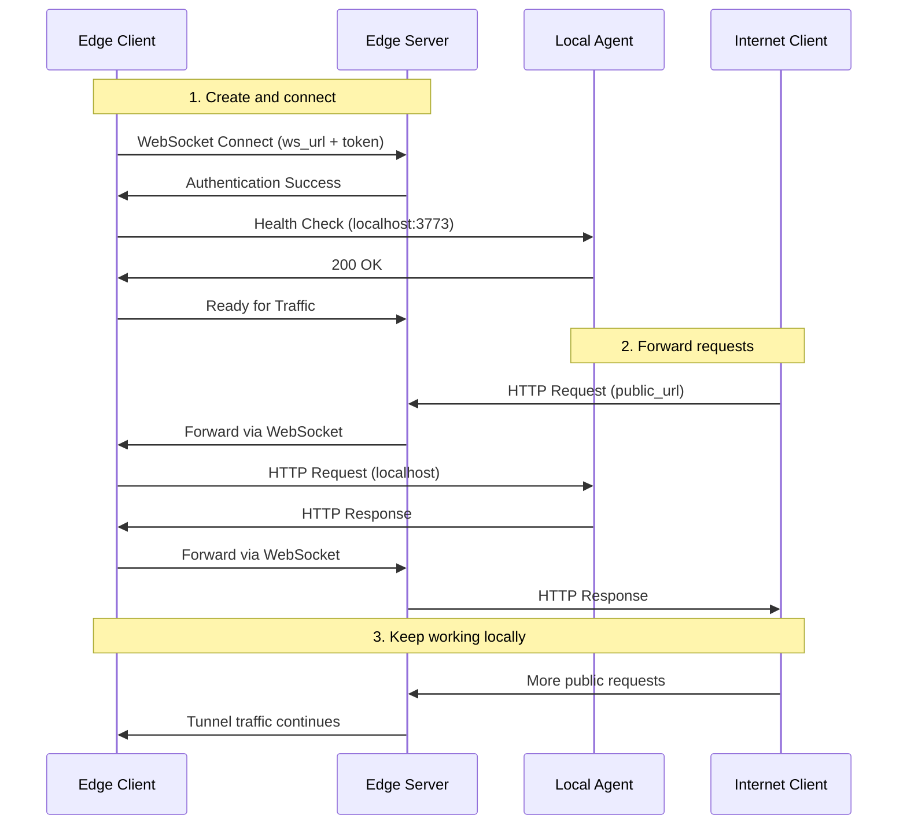

Local development works well right up until something outside your machine needs to reach your agent. Webhooks need a public callback. OAuth flows need a public redirect URL. Teammates and clients need something they can actually hit from the internet.

## Why Bindu Edge Matters

The Bindu Edge Client gives your locally running agent a public internet URL without asking you to deploy it to cloud infrastructure first. It creates a secure tunnel from your machine to the internet using WebSocket connections, so you can keep developing locally while exposing the agent to the outside world.

| Working locally without a tunnel | Using Bindu Edge |
| --- | --- |
| Local agent stays stuck on `localhost` | Local agent gets a public URL in seconds |
| Webhooks and third-party callbacks are awkward to test | External services can reach your local agent directly |
| Sharing work-in-progress means deploying or screen sharing | Teammates and stakeholders can hit the tunneled URL |
| Real-world integration testing is harder | You can test public-facing flows from your usual dev environment |
| Every demo pushes you toward temporary infrastructure | Demos can run straight from your machine |

That is the shift: Bindu Edge keeps your agent local, but removes the "local only" part when you need to test, share, or demo it.

<Note>
This is meant for development, testing, and demos. It gives you production-like reachability without the overhead of deployment, containerization, or cloud setup.
</Note>

## How Bindu Edge Works

The Bindu Edge Client exposes your local agent through a secure tunnel backed by WebSocket connections. Your code keeps running on your machine. The tunnel handles the internet-facing path.

### The Core Model

The practical benefits are straightforward:

- instant public access for a local agent
- no Docker requirement during development
- no cloud setup while iterating
- local tooling and IDE workflow stay intact
- changes made locally become reachable through the public URL

It also keeps the protocol side intact:

- DID support
- A2A protocol compatibility
- message routing from other agents
- discovery through the Bindu Directory
- multi-agent testing without deploying everything

<CardGroup cols={3}>
  <Card title="Fast Setup" icon="link">
    Create a tunnel, point it at `localhost`, and get a public URL without standing up cloud infrastructure.
  </Card>
  <Card title="Secure Tunnel" icon="shield-check">
    Every tunnel uses token-based authentication and secure WebSocket connections.
  </Card>
  <Card title="Agent-Friendly" icon="globe">
    Your local agent keeps its DID and A2A protocol behavior while being reachable from the internet.
  </Card>
</CardGroup>

### The Lifecycle: Create, Connect, Forward

Under the hood, every Edge session moves through three practical stages.



<Steps>
  <Step title="Create">
    First, create a tunnel in [bindus.directory](https://bindus.directory). After that, you receive three values:

    - `ws_url` - WebSocket URL for the tunnel connection, for example `wss://tunnel.bindus.directory/ws`
    - `token` - authentication token for secure access, for example `bnd_tk_abc123...`
    - `public_url` - the public internet URL for your agent, for example `https://agent-abc.bindus.directory`

    Keep the token secure. It is what allows traffic to be forwarded to your local machine.
  </Step>

  <Step title="Connect">
    The Edge Client uses that configuration to connect to the Edge Server and verify that your local agent is reachable.

    The basic request path looks like this:

    ```text
    Internet Request -> Bindu Edge Server -> WebSocket Tunnel -> Local Agent
                      (bindus.directory)                      (localhost:3773)
    ```

    At that point the tunnel is live, but your code is still running locally on the configured port.
  </Step>

  <Step title="Forward">
    Once connected, incoming internet traffic is forwarded through the tunnel to your local agent and the response takes the same path back.

    Request flow:

    1. **Incoming Request**: External client sends request to `https://agent-abc.bindus.directory`
    2. **Edge Server**: Bindu Edge server receives and validates the request
    3. **Authentication**: Server verifies the request against tunnel configuration
    4. **WebSocket Forward**: Request is forwarded through the WebSocket tunnel
    5. **Local Processing**: Edge client receives request and forwards to `localhost:3773`
    6. **Agent Response**: Your local agent processes and returns response
    7. **Return Path**: Response flows back through tunnel to Edge server
    8. **Client Response**: Original client receives response from your local agent
  </Step>
</Steps>

---

## Quick Start

### Prerequisites

Before starting, make sure you have:

- a Bindu agent running locally
- access to [bindus.directory](https://bindus.directory)
- a Python environment with Bindu installed

### Create A Tunnel

Visit [bindus.directory](https://bindus.directory) and set up your tunnel:

<Steps>
  <Step title="Log in to your account">
    Navigate to bindus.directory and authenticate with your credentials.
  </Step>

  <Step title="Navigate to tunnels section">
    Find the "Tunnels" or "Edge" section in your dashboard.
  </Step>

  <Step title="Create a new tunnel">
    Click "Create Tunnel" and configure your tunnel settings.
  </Step>
</Steps>

After creation, save the `ws_url`, `token`, and `public_url`.

### Configure Your Local Agent

Create an `edge.config.json` file in your project directory:

```json edge.config.json
{
  "ws_url": "wss://tunnel.bindus.directory/ws/your-tunnel-id",
  "token": "bnd_tk_your_secret_token_here",
  "local_port": 3773
}
```

Configuration options:

| Field | Description | Default | Required |
| --- | --- | --- | --- |
| `ws_url` | WebSocket URL provided by bindus.directory | - | Yes |
| `token` | Authentication token for your tunnel | - | Yes |
| `local_port` | Port where your local agent is running | `3773` | No |

<Note>
`local_port` defaults to `3773`, which is Bindu's default port. You only need to change it if your agent is listening somewhere else.
</Note>

### Start Your Local Agent

Make sure the agent is actually running on the configured port:

```bash
# Standard Bindu agent startup
uv run python -m your_agent

# Or with uvicorn directly
uvicorn your_agent.main:app --host 0.0.0.0 --port 3773
```

Verify local reachability:

```bash
curl http://localhost:3773/health
```

### Start The Edge Client

Run the client in a separate terminal:

```bash
uv run python -m bindu.edge_client
```

Expected output:

```text
🌐 Bindu Edge Client Starting...
✓ Connected to tunnel: wss://tunnel.bindus.directory/ws/your-tunnel-id
✓ Authentication successful
✓ Local agent detected on port 3773
✅ Your agent is now live at: https://agent-abc.bindus.directory

Press Ctrl+C to stop the tunnel
```

### Test The Connection

Health check:

```bash
curl https://agent-abc.bindus.directory/health
```

Or send an A2A protocol message:

```bash
curl -X POST https://agent-abc.bindus.directory/a2a/task/create \
  -H "Content-Type: application/json" \
  -d '{
    "task_id": "test-task-001",
    "input": {
      "action": "greet",
      "message": "Hello from the internet!"
    }
  }'
```

### Environment Variables

Instead of using `edge.config.json`, you can set environment variables:

```bash
export BINDU_EDGE_WS_URL="wss://tunnel.bindus.directory/ws/your-tunnel-id"
export BINDU_EDGE_TOKEN="bnd_tk_your_secret_token"
export BINDU_EDGE_LOCAL_PORT="3773"

uv run python -m bindu.edge_client
```

## Configuration And Variants

### Custom Port Configuration

If your agent runs on a non-standard port:

```json edge.config.json
{
  "ws_url": "wss://tunnel.bindus.directory/ws/your-tunnel-id",
  "token": "bnd_tk_your_secret_token",
  "local_port": 8080
}
```

### Multiple Agents

Run multiple agents with separate tunnels.

**Terminal 1 - Agent A on port 3773:**

```bash
# edge-agent-a.config.json
{
  "ws_url": "wss://tunnel.bindus.directory/ws/tunnel-a",
  "token": "bnd_tk_token_a",
  "local_port": 3773
}

uv run python -m bindu.edge_client --config edge-agent-a.config.json
```

**Terminal 2 - Agent B on port 3774:**

```bash
# edge-agent-b.config.json
{
  "ws_url": "wss://tunnel.bindus.directory/ws/tunnel-b",
  "token": "bnd_tk_token_b",
  "local_port": 3774
}

uv run python -m bindu.edge_client --config edge-agent-b.config.json
```

### Programmatic Usage

```python
from bindu.edge_client import EdgeClient
import asyncio

async def main():
    client = EdgeClient(
        ws_url="wss://tunnel.bindus.directory/ws/your-tunnel-id",
        token="bnd_tk_your_secret_token",
        local_port=3773
    )
    
    await client.connect()
    print(f"✅ Agent accessible at: {client.public_url}")
    
    # Keep running
    try:
        await client.run_forever()
    except KeyboardInterrupt:
        await client.disconnect()
        print("👋 Tunnel closed")

if __name__ == "__main__":
    asyncio.run(main())
```

## Security Model

The Edge path adds public reachability, so the security assumptions need to stay clear.

This setup uses several layers:

1. **Token Authentication**: Every tunnel requires a unique token
2. **WSS Encryption**: WebSocket connections use TLS encryption
3. **Request Validation**: Edge server validates all incoming requests
4. **Local Firewall**: Your local machine's firewall remains intact
5. **No Port Forwarding**: No need to open ports or configure routers

<Note>
Never share your tunnel token publicly. It grants direct access to forward traffic to your local machine.
</Note>

### Comparison With Alternatives

<CardGroup cols={3}>
  <Card title="A2A-aware" icon="globe">
    Bindu Edge supports the A2A protocol and DID integration directly.
  </Card>
  <Card title="Directory-integrated" icon="link">
    Tunnel creation and discovery connect back to bindus.directory instead of living as a generic tunnel alone.
  </Card>
  <Card title="Development-focused" icon="shield-check">
    It is designed for local development, testing, and demos rather than standing in for production hosting.
  </Card>
</CardGroup>

| Feature | Bindu Edge | ngrok | localtunnel | SSH Tunnel |
| --- | --- | --- | --- | --- |
| A2A Protocol Support | ✅ Native | ❌ No | ❌ No | ❌ No |
| Setup Complexity | ⭐ Simple | ⭐⭐ Medium | ⭐ Simple | ⭐⭐⭐ Complex |
| Authentication | ✅ Token | ✅ API Key | ❌ Public | 🔑 SSH Keys |
| DID Integration | ✅ Yes | ❌ No | ❌ No | ❌ No |
| Free Tier | ✅ Yes | ✅ Limited | ✅ Yes | ✅ Yes |
| Bindu Directory | ✅ Integrated | ❌ No | ❌ No | ❌ No |
| Custom Domains | ✅ Yes | 💰 Paid | ❌ No | ⚙️ Manual |
| WebSocket Support | ✅ Native | ✅ Yes | ✅ Yes | ✅ Yes |

## Real-World Use Cases

<AccordionGroup>
  <Accordion title="Development and testing">
    Your agent runs on `localhost:3773`, but is reachable through a public URL such as `https://your-agent.bindus.directory`.

    Common use cases:

    - develop and test webhooks without ngrok or similar tools
    - test OAuth callbacks that require public redirect URLs
    - validate API integrations that need to reach your agent
    - debug in real-time with full IDE support
  </Accordion>

  <Accordion title="Team collaboration">
    Team members can interact with your work-in-progress without waiting for a staging deployment.

    Typical uses:

    - let team members interact with your local agent
    - gather feedback without pushing to staging
    - collaborate on features before committing code
    - test integrations with other team members' agents
  </Accordion>

  <Accordion title="Client demonstrations">
    The Edge Client is useful when you want to demo the latest version of the agent without waiting for CI/CD or provisioning a temporary environment.

    Typical uses:

    - demo new features directly from your development environment
    - make real-time adjustments during presentations
    - showcase work-in-progress without formal deployments
    - get immediate client feedback and iterate quickly
  </Accordion>

  <Accordion title="Webhook development and multi-agent testing">
    The same tunnel is helpful for inbound webhooks and hybrid agent testing.

    Common webhook scenarios:

    - payment provider webhooks such as Stripe and PayPal
    - communication platform callbacks such as Slack and Discord
    - external service notifications such as GitHub and Jira
    - third-party API events

    Multi-agent uses:

    - run one agent locally while others are in production
    - test new agent interactions without deploying everything
    - debug communication issues in a hybrid environment
    - validate protocol changes before deployment
  </Accordion>
</AccordionGroup>

## Troubleshooting And Limits

### Connection Problems

**Problem: "Cannot connect to tunnel"**

```bash
❌ Error: Failed to connect to wss://tunnel.bindus.directory/ws/tunnel-id
```

Solutions:

1. Verify your `ws_url` is correct and includes the tunnel ID
2. Check your internet connection
3. Ensure the tunnel still exists at bindus.directory
4. Verify no firewall is blocking WebSocket connections

**Problem: "Authentication failed"**

```bash
❌ Error: Token authentication failed
```

Solutions:

1. Double-check your `token` value in `edge.config.json`
2. Ensure the token hasn't expired (check bindus.directory dashboard)
3. Verify you haven't regenerated the token since creating the config
4. Check for extra spaces or quotes in the token string

**Problem: "Cannot reach local agent"**

```bash
❌ Error: Connection refused to localhost:3773
```

Solutions:

1. Ensure your Bindu agent is actually running
2. Verify it's listening on the correct port (`local_port` in config)
3. Check if another process is using the port: `lsof -i :3773`
4. Try accessing `http://localhost:3773/health` directly

**Problem: Requests timeout through the tunnel**

Solutions:

1. Check if your local agent is responding slowly
2. Increase timeout settings in your agent configuration
3. Verify your internet connection stability
4. Check Edge client logs for error messages

**Problem: Edge client can't bind**

```bash
❌ Error: Address already in use
```

Solutions:

1. Another Edge client might already be running
2. Kill existing process: `pkill -f bindu.edge_client`
3. Find and stop the conflicting process: `lsof -i :3773`

### Best Practices

- start with local testing before enabling the tunnel
- use tunnels temporarily and close them when not needed
- rotate tokens regularly
- monitor logs from both the agent and edge client
- test locally first before exposing via tunnel

Add to `.gitignore`:

```gitignore
# Bindu Edge Client
edge.config.json
*.edge.config.json
.bindu-edge/
```

### Performance Tips

- close idle tunnels because each tunnel consumes resources
- use local testing first and only tunnel when public access is necessary
- monitor bandwidth because large file transfers may be slow
- check latency because the tunnel adds about `50-200ms` depending on location
- limit concurrent requests because a local machine may not handle production load

### Current Limitations

- **Development Only**: Not recommended for production traffic
- **Single Machine**: One tunnel per local agent instance
- **Bandwidth**: Limited by your local internet connection
- **Latency**: Additional `~50-200ms` compared to direct deployment
- **Uptime**: Depends on your local machine staying powered on
- **Scalability**: Cannot auto-scale like cloud deployments

Not suitable for:

- production deployments
- high-traffic applications
- mission-critical services
- 24/7 availability
- load balancing

When to move to production:

- high availability and uptime guarantees
- auto-scaling based on traffic
- load balancing across multiple instances
- professional monitoring and alerting
- disaster recovery and backups
- SLA commitments to users

## Next Steps

<CardGroup cols={2}>
  <Card title="Test Webhooks" icon="webhook" href="/bindu/learn/notification/overview">
    Configure webhook integrations that require public URLs.
  </Card>
  <Card title="Multi-Agent Testing" icon="network-wired" href="/bindu/concepts/protocol">
    Test agent-to-agent communication with your local agent.
  </Card>
  <Card title="Deploy to Production" icon="cloud-upload" href="/bindu/create-bindu-agent/deploy">
    Ready to go live? Learn how to deploy your agent properly.
  </Card>
  <Card title="Join Community" icon="users" href="/bindu/introduction/getting-help">
    Get help and share your Edge Client experiences.
  </Card>
</CardGroup>

## Related

* https://www.getbindu.com

---

<span className="brand-quote">
  

  <span className="brand-quote-text">
    Bindu Edge gives your local agent{" "}
    <span className="brand-quote-highlight">
      public reach without a full deployment step
    </span>
    , so development, testing, and demos can stay fast.
  </span>
</span>
