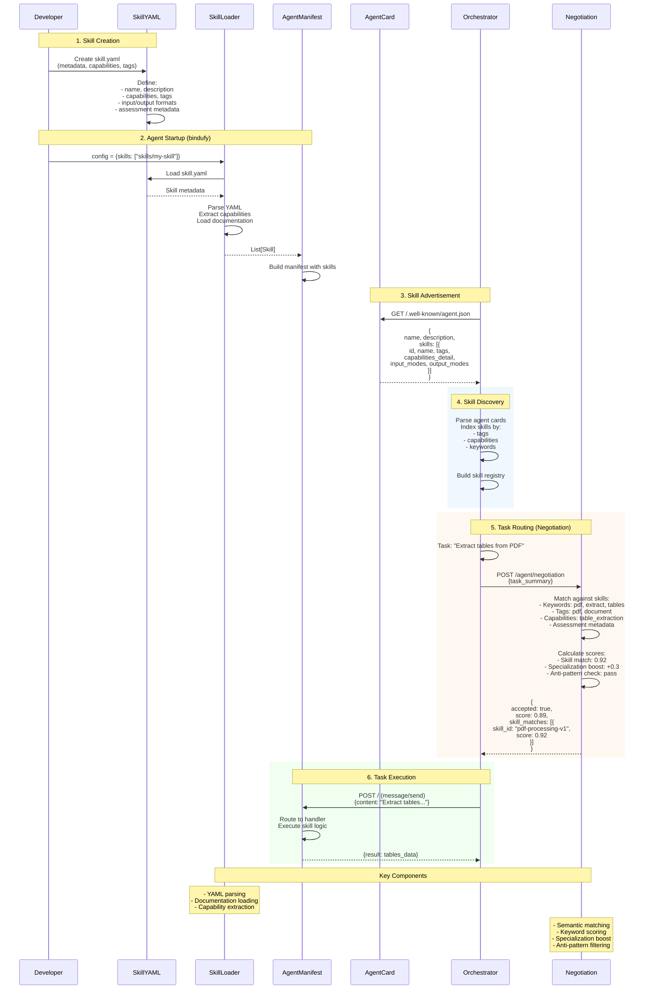

Agents can handle tasks directly, but orchestration gets a lot harder when other systems cannot see what those agents are actually good at, how they describe inputs, or which work they should decline.

## Why Skills Matter

In a multi-agent setup, capability discovery should not depend on guesswork, one-off prompts, or hardcoded routing logic. If an orchestrator needs an agent to extract tables from a PDF, fill a form, or answer domain-specific questions, it needs a structured way to inspect what that agent can do before assigning work.

| Ad Hoc Capability Routing | Bindu Skills |
| --- | --- |
| Capabilities are inferred indirectly from prompts or code | Capabilities are declared in reusable skill metadata |
| Discovery depends on manual documentation | Discovery uses `skill.yaml`, tags, and capabilities |
| Routing logic is hardcoded per agent | Routing uses negotiation metadata and skill matching |
| Input and output expectations vary by implementation | Input and output formats are documented per skill |
| Agents are harder to compare and select | Agents can advertise skills through their manifest and agent card |

That is the shift: Bindu gives agents a reusable capability layer that can be loaded, advertised, discovered, and matched during orchestration. That layer is the **Skills System**.

<Note>
If an orchestrator needs a specialized capability such as PDF table extraction, it should not have to guess from a description alone. It should be able to inspect structured skill metadata and route the task with confidence.
</Note>

## How Skills Work

Bindu uses **skills** to provide reusable, discoverable, and negotiable capabilities for AI agents. Each skill is defined in YAML and becomes part of the agent's advertised manifest during orchestration.

### The YAML Format

Bindu uses a structured skill definition:

```yaml
skill_id: "pdf-processing-v1"
name: "PDF Processing"
version: "1.0.0"
description: "Extract text, tables, and forms from PDF documents"

capabilities:
  - text_extraction
  - table_extraction
  - form_filling
  - ocr_support

tags:
  - pdf
  - document
  - extraction

input_structure: |
  {
    "file": "base64_encoded_pdf_or_url",
    "operation": "extract_text|fill_form|extract_tables",
    "options": {
      "ocr": true,
      "language": "eng"
    }
  }

output_format: |
  {
    "success": true,
    "pages": [{"page_number": 1, "text": "...", "confidence": 0.98}],
    "metadata": {"total_pages": 10, "processing_time_ms": 1500}
  }

# Assessment metadata for negotiation
assessment:
  keywords:
    - pdf
    - extract
    - document

  specializations:
    - domain: invoice_processing
      confidence_boost: 0.3

  anti_patterns:
    - "pdf editing"
    - "pdf creation"
```

The structure is readable to developers and precise for orchestration systems:

- `skill_id` uniquely identifies the skill
- `name` and `description` make the capability human-legible
- `capabilities` and `tags` support discovery and matching
- `input_structure` and `output_format` document execution expectations
- `assessment` helps the negotiation system score when the skill should or should not be selected

<CardGroup cols={3}>
  <Card title="Reusable" icon="layer-group">
    Skills package capability metadata into a portable format that can be attached to different agents.
  </Card>
  <Card title="Discoverable" icon="search">
    Tags, capabilities, and documentation make skills visible to orchestrators and other agents.
  </Card>
  <Card title="Routable" icon="route">
    Assessment metadata gives the negotiation system structured signals for intelligent task selection.
  </Card>
</CardGroup>

### The Lifecycle: Creation, Advertisement, Routing

Under the hood, every Bindu skill moves through practical stages from definition to execution.



<Steps>
  <Step title="Creation">
    Create a YAML file in `skills/` directory and define the skill metadata that the system will use for discovery, routing, and documentation.

    ```yaml
    # skills/my-skill/skill.yaml
    skill_id: "my-skill-v1"
    name: "My Skill"
    version: "1.0.0"
    description: "What this skill does"

    capabilities:
      - capability1
      - capability2

    tags:
      - tag1
      - tag2

    documentation: |
      # My Skill

      Detailed documentation here...

    input_structure: |
      {
        "field1": "value",
        "field2": 123
      }

    output_format: |
      {
        "result": "output"
      }

    examples:
      - title: "Example 1"
        input:
          field1: "test"
        output:
          result: "success"

    assessment:
      keywords:
        - keyword1
        - keyword2
    ```

    Think of it like this: the skill file is the capability contract. It tells Bindu what the skill is, how to describe it, and how to match it during orchestration.
  </Step>

  <Step title="Advertisement">
    Once defined, register the skill in the agent config so Bindu can load it during startup, parse the YAML, extract capabilities, and include it in the agent manifest.

    ```python
    config = {
        "name": "my_agent",
        "skills": ["skills/my-skill"],  # Path to skill directory
    }
    ```

    This is what makes the skill visible to orchestrators through the agent card and available for capability discovery across environments.
  </Step>

  <Step title="Routing">
    Other systems can inspect skill metadata through the skill APIs and use the negotiation system to decide whether an agent is a good fit for a task.

    <CodeGroup>
      ```bash List Skills
      GET /agent/skills
      ```

      ```json Response
      {
        "skills": [
          {
            "skill_id": "pdf-processing-v1",
            "name": "PDF Processing",
            "version": "1.0.0",
            "capabilities": ["text_extraction", "table_extraction"]
          }
        ]
      }
      ```
    </CodeGroup>

    Routing works because the skill metadata, documentation, and assessment fields give the negotiation system structured signals instead of forcing it to infer capability from free-form descriptions alone.
  </Step>
</Steps>

---

## Skill API Endpoints

Skills are exposed through dedicated APIs so orchestrators and developers can inspect what an agent supports.

<CodeGroup>
  ```bash List All Skills
  GET /agent/skills
  ```

  ```json Response
  {
    "skills": [
      {
        "skill_id": "pdf-processing-v1",
        "name": "PDF Processing",
        "version": "1.0.0",
        "capabilities": ["text_extraction", "table_extraction"]
      }
    ]
  }
  ```
</CodeGroup>

<CodeGroup>
  ```bash Get Skill Details
  GET /agent/skills/{skill_id}
  ```

  ```json Response
  {
    "skill_id": "pdf-processing-v1",
    "name": "PDF Processing",
    "description": "Extract text, tables, and forms from PDF documents",
    "input_structure": {...},
    "output_format": {...},
    "examples": [...]
  }
  ```
</CodeGroup>

<CodeGroup>
  ```bash Get Skill Documentation
  GET /agent/skills/{skill_id}/documentation
  ```

  ```text Response
  Returns human-readable documentation in Markdown format.
  ```
</CodeGroup>

Each field has a specific job:

- `skill_id` is the unique identifier for the skill
- `name` is the human-readable label for the capability
- `version` tracks the skill using semantic versioning
- `capabilities` lists specific functions the skill supports
- `description` explains what the skill does
- `input_structure` documents how requests should be shaped
- `output_format` documents the expected result structure
- `examples` shows representative input and output usage

<Note>
Skills can include `documentation`, `error_handling`, `best_practices`, and `constraints` alongside execution-oriented fields. That makes the metadata useful both for machines and for humans reading the contract.
</Note>

### Metadata Standards

<CardGroup cols={3}>
  <Card title="Required Fields" icon="check-circle">
    `skill_id`, `name`, `version`, and `description` define the minimum identity and purpose of a skill.
  </Card>
  <Card title="Optional Fields" icon="clipboard-list">
    `capabilities`, `tags`, `documentation`, `input_structure`, `output_format`, `examples`, `error_handling`, `best_practices`, `constraints`, and `assessment` extend discovery and usability.
  </Card>
  <Card title="Assessment Metadata" icon="scale-balanced">
    `keywords`, `specializations`, `anti_patterns`, and `complexity_indicators` help the negotiation system make more accurate routing decisions.
  </Card>
</CardGroup>

## The Value of Structured Skill Metadata

Capability metadata only matters if it helps the system choose the right agent, reject the wrong one, and explain how execution should work before the task is sent.

This structure supports:

- **Discovery** - Skills can be indexed by tags, capabilities, and keywords
- **Routing** - Negotiation can score fit using assessment metadata
- **Clarity** - Input and output expectations are documented explicitly

This is the point of the whole model: capability selection becomes a structured orchestration step instead of a guess.

## Real-World Use Cases

<AccordionGroup>
  <Accordion title="Document processing and extraction">
    A PDF-focused skill can advertise text extraction, table extraction, form filling, and OCR support so orchestrators can route the task to the right agent before execution.

    ```yaml
    skill_id: "pdf-processing-v1"
    name: "PDF Processing"
    version: "1.0.0"
    description: "Extract text, tables, and forms from PDF documents"

    capabilities:
      - text_extraction
      - table_extraction
      - form_filling
      - ocr_support

    tags:
      - pdf
      - document
      - extraction
    ```
  </Accordion>

  <Accordion title="Negotiation-aware task selection">
    The assessment block gives the negotiation system a practical way to match requests, boost domain expertise, and avoid known bad matches.

    ```yaml
    assessment:
      # Keywords for semantic matching
      keywords:
        - pdf
        - extract
        - document

      # Domain specializations with confidence boost
      specializations:
        - domain: invoice_processing
          confidence_boost: 0.3
        - domain: form_filling
          confidence_boost: 0.2

      # Patterns this skill should NOT match
      anti_patterns:
        - "pdf editing"
        - "pdf creation"

      # Complexity indicators for performance estimation
      complexity_indicators:
        simple:
          - "single page"
          - "extract text"
        medium:
          - "multiple pages"
          - "fill form"
        complex:
          - "scanned document"
          - "ocr"
    ```
  </Accordion>

  <Accordion title="Agent-level skill registration">
    Skills are attached at agent startup, which lets a single agent advertise one or more reusable capabilities through its manifest and agent card.

    ```python
    config = {
        "name": "my_agent",
        "skills": ["skills/my-skill"],  # Path to skill directory
    }
    ```
  </Accordion>

  <Accordion title="Reusable skill authoring patterns">
    A skill can bundle documentation, examples, structured inputs, and structured outputs so both developers and orchestrators understand how to use it.

    ```yaml
    documentation: |
      # My Skill

      Detailed documentation here...

    input_structure: |
      {
        "field1": "value",
        "field2": 123
      }

    output_format: |
      {
        "result": "output"
      }

    examples:
      - title: "Example 1"
        input:
          field1: "test"
        output:
          result: "success"
    ```
  </Accordion>
</AccordionGroup>

## Best Practices

<CardGroup cols={2}>
  <Card title="Design Skills Clearly" icon="pencil-ruler">
    Single responsibility, clear naming, versioning, and strong documentation make skills easier to discover and safer to route.
  </Card>
  <Card title="Model Inputs Honestly" icon="code">
    Use structured formats, document validation and error handling, include realistic examples, and keep assessment metadata accurate.
  </Card>
</CardGroup>

---

## Related

* `examples/skills/`
* `skills/question-answering/`
* `skills/pdf-processing/`
* `skills/cbt-*/`

---

<span className="brand-quote">
  

  <span className="brand-quote-text">
    Bindu lets your agents share{" "}
    <span className="brand-quote-highlight">
      reusable, discoverable capabilities
    </span>
    , so orchestration can stay structured as your network grows.
  </span>
</span>
